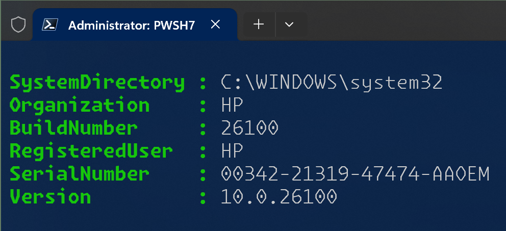
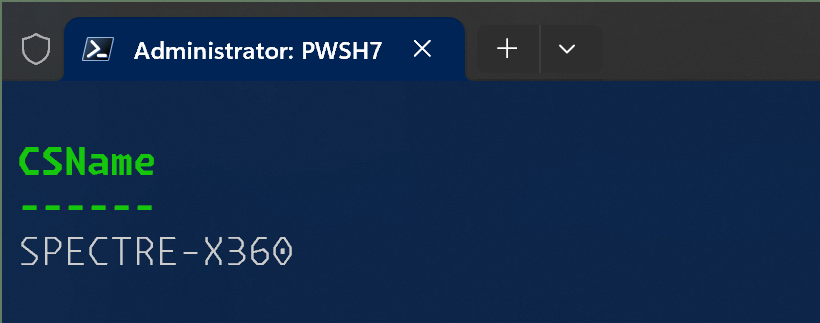
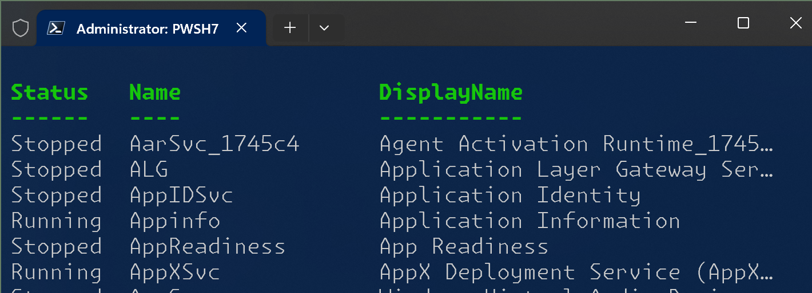
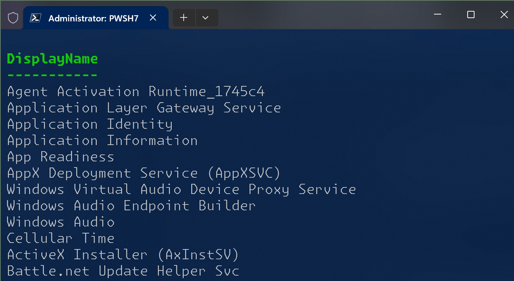
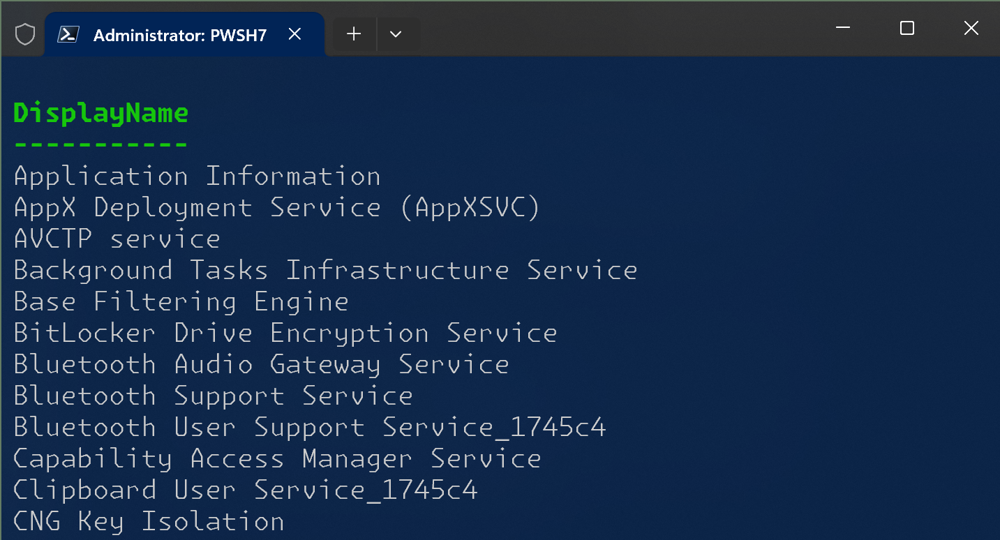
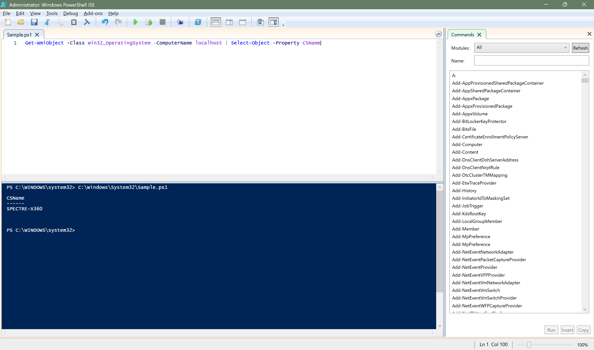
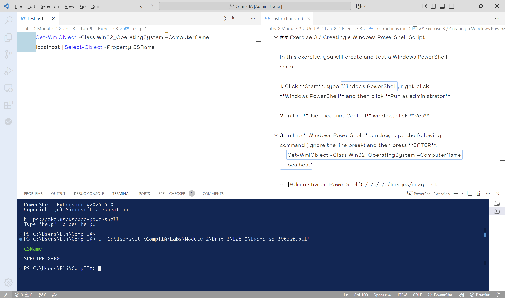

# Lab 8

## Overview

In this exercise, you will create and test a Windows PowerShell script.

## Instructions

1. Click **Start**, type `Windows PowerShell`, right-click **Windows PowerShell** and then click **Run as administrator**.

2. In the **User Account Control** window, click **Yes**.

3. In the **Windows PowerShell** window, type the following command (ignore the line break) and then press **ENTER**:
    `Get-WmiObject -Class Win32_OperatingSystem –ComputerName localhost`

    

4. Examine the returned results.

5. In the **Windows PowerShell** window, type the following command and then press **ENTER**:
   `Get-WmiObject -Class Win32_OperatingSystem –ComputerName localhost | Select-Object -Property CSName`

    

    >[!NOTE] To save a bit of time, you can press the **UPARROW** to select the original command and then edit it.

6. Examine the returned results.
   - Your computer name is displayed in a table. The command uses a pipe (|) to send the output from one command to another command.

7. In the Windows PowerShell window, type the following command and then press **ENTER**:
   `Get-Service`

    

8. Examine the returned results.
   - A list of all services on your computer is displayed.

9. In the Windows PowerShell window, type the following command and then press **ENTER**:
    `Get-Service | Select DisplayName`

    

10. Examine the returned results. The same list of services is displayed but this time the output is filtered down to the service's "friendly" name.

11. In the Windows PowerShell window, type the following command and then press **ENTER**:
    `Get-WmiObject win32_service | Select DisplayName, State | Sort State, DisplayName`

    

    > Running a piped Windows PowerShell cmdlet

12. Examine the returned results. A list of all services on your computer is displayed, sorted by state and then display name.
    - So far we have been running commandlets individually. You can also create PowerShell scripts in the editor environment and save them as files.

13. Click **Start**, type **Windows PowerShell**, right-click **Windows PowerShell ISE** and then click **Run as administrator**.

14. In the **User Account Control** window, click **Yes**.

15. In the Untitled1.ps1 area, type the following code as a single line:
    `Get-WmiObject -Class Win32_OperatingSystem –ComputerName localhost | Select-Object -Property CSName`

    >[!NOTE] As you type, suggestion boxes appear helping you to autocomplete statements.
    >
    >Also notice that the editor applies color-coding to distinguish parts of your code.
    >
    >These features make a development environment much easier to work in than a plain text editor like Notepad.

16. On the toolbar, click Save.

17. In the **Save As** window, in the navigation pane, expand **This PC**.

18. Expand **Local Disk (C:)**, expand **Windows**, and then click **System32**.

19. In the File name box, type `Sample.ps1` and then click **Save**.

20. In the In the **Administrator: Windows PowerShell ISE** window, on the toolbar, click **Run** . You receive an error.
    - This is because unsigned scripts are blocked by default. To enable scripts without a valid coding certificate to run, switch to the Windows PowerShell window.

21. In the Administrator: Windows PowerShell window, type the following command and then press **ENTER**:
    `Set-ExecutionPolicy RemoteSigned`

22. When prompted, type **A** and press **ENTER**.

23. Switch to **Windows PowerShell ISE** and click **Run**.

24. Your simple one line script runs.

    
    

25. Switch to the Windows PowerShell window.

26. At the prompt, type **Sample.ps1** and then press **Enter**. Your simple one line script runs.

27. Close all open windows and apps.
