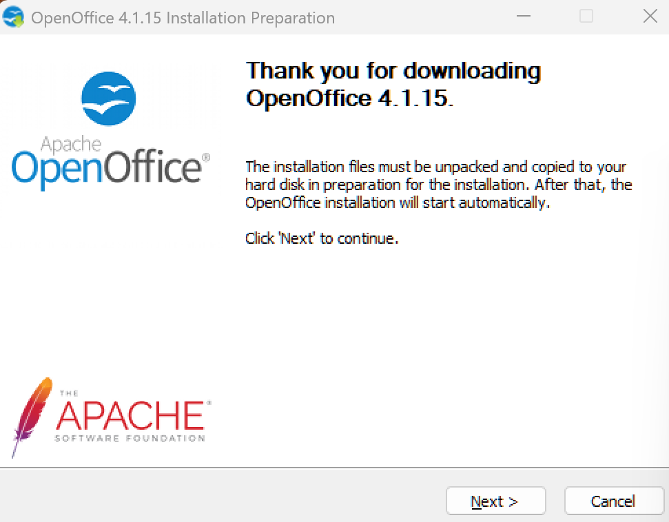
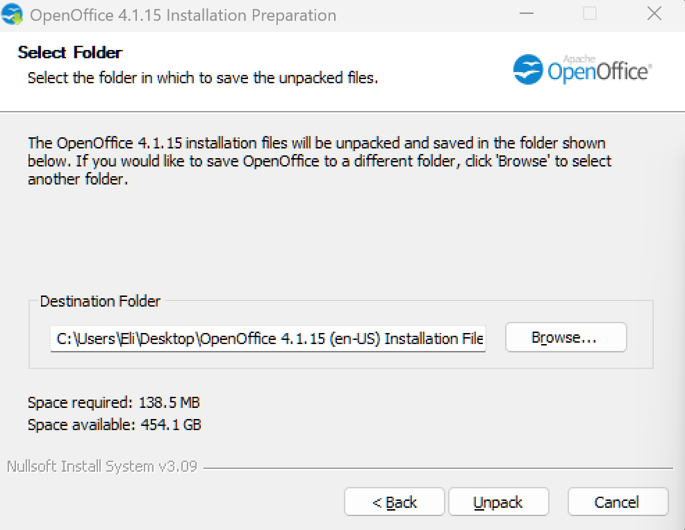
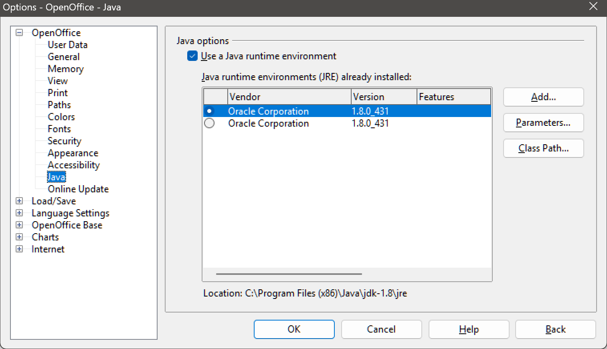

# Lab 10 / Exercise 1

## Overview

In this exercise, you will install Apache OpenOffice to make its database application available.

## Instructions

1. If necessary, start your computer and sign in.

2. Open a browser and navigate to [openoffice.org/download](https://www.openoffice.org/download).

3. Under the **Download Apache OpenOffice** heading:

   - Select **Windows (EXE)**.
   - Select **English (US)**.
   - Click **Download full installation**.

   > This will download the Apache OpenOffice Windows executable.

4. In the prompt at the bottom of the window:

   - Click **Save**.
   - When the download is complete, click **Run**.

   > [!NOTE] Notice
   > Windows may not trust the installer. In this case, you must trust the site you downloaded the file from (sourceforge.net). For more information on verifying the installer, refer to OpenOffice's [FAQs](https://www.openoffice.org/security/faq.html#verify).

5. In the **User Account Control** window, read the warning and click **Yes**.

6. In the **OpenOffice 4.1.5 Setup Wizard**, click **Next**.

7. On the **Choose Install Location** page, click **Install**.

8. On the **Welcome to the Installation Wizard for OpenOffice 4.1.5** page, click **Next**.

9. On the **Customer Information** page, click **Next**.

10. On the **Setup Type** page, select **Custom** and then click **Next**.

11. Review the components and click **Next**.

12. On the **File Type** page, clear all checkboxes and then click **Next**.

    > This step is very important if you already have Microsoft Office installed.

13. On the **Ready to Install the Program** page, click **Install**.

14. When prompted, click **Finish**.

15. On the desktop, double-click the **OpenOffice 4.1.5** icon.

16. On the **Welcome** page, click **Next**.

17. Complete the **User Name** information and then click **Finish**.

    > [!NOTE] Notice
    > You require the Java Runtime Environment to use the database features of OpenOffice. This should have been installed as part of the programming labs earlier in this module.

18. From the **Tools** menu, select **Options**. In the **Options** dialog, select **Java**.

    > After a few seconds, the dialog should update to show a path to the Java Runtime Environment.

    

    > The installation files must be unpacked and copied to your hard disk because the setup process requires extracting necessary components and preparing them for proper installation.
    >
    > This step ensures that the software can be installed correctly and that all required files are in the apprpriate locations before the actual installation begins.

    
    > The installer temporarily stores the files on the desktop for easy access during the unpacking and installation process.

    

    > Verifying the Java path

19. Click OK.

20. Close the Open Office window.
