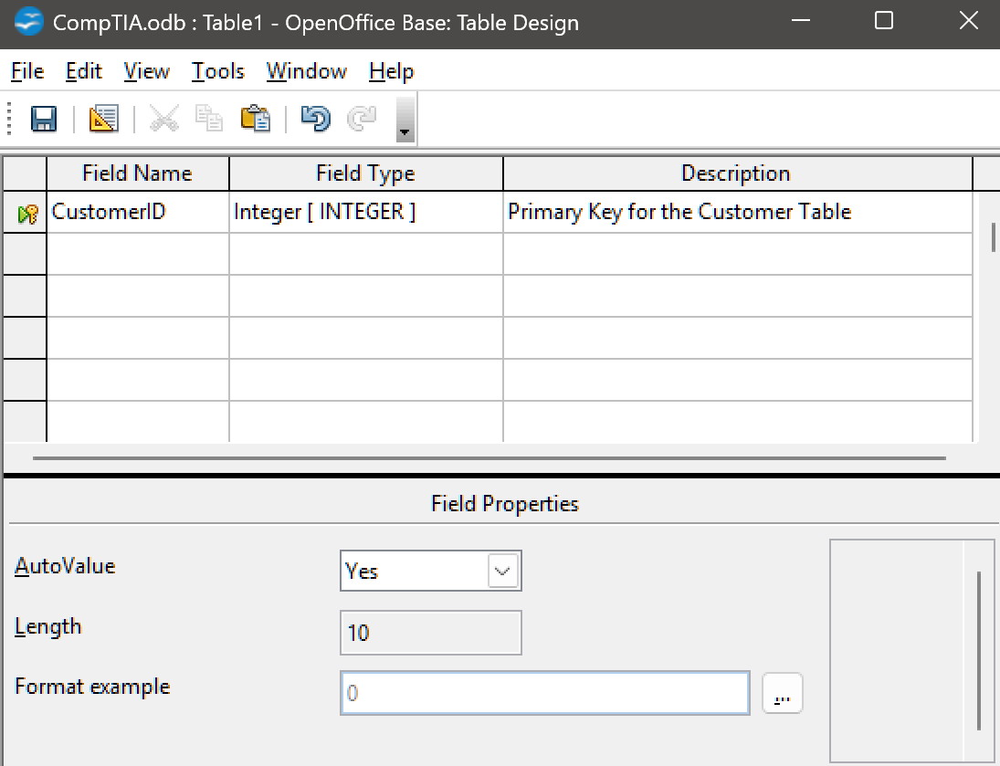
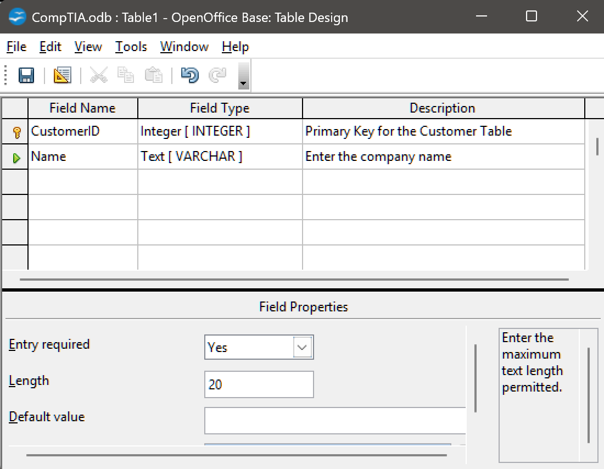
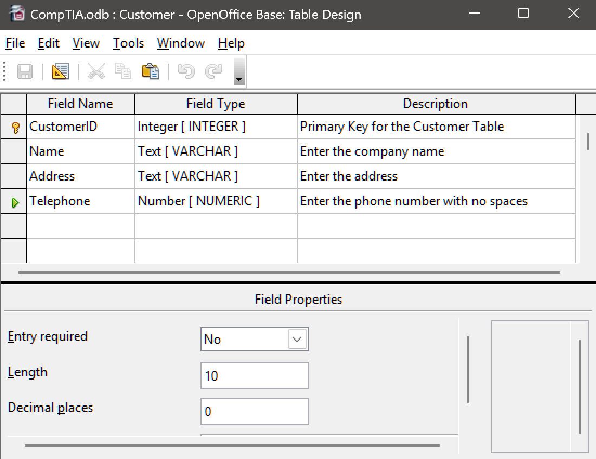
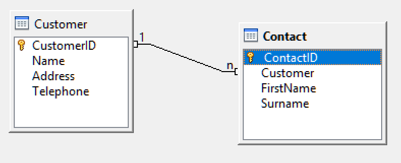

# Lab 10 / Exercise 2

## Overview

In this exercise, you will create a new database and create database tables.

## Instructions

1. On the desktop, open the **OpenOffice** icon.

2. In OpenOffice, click **Database**.

3. In the **Database Wizard**, on the **Select database** tab, click **Create a new database** and then click **Next**.

4. On the **Save and proceed** tab, click **Finish**.

5. In the **Save As** window, in the navigation pane, click **Documents**.

6. In the **File name** box, type **CompTIA** and then click **Save**.

7. In the open database window, click **Tables** and then click **Create Table in Design View**.

   > As a first step, we will create a primary key for the table.
   > As the primary key must always be unique, it is a good idea to use an automatically generated number for this field.

8. In the new table window, in the **Field Name** column, type **CustomerID**.

9. In the **Field Type** column, select **`Integer [INTEGER]`**, and in the **Description** column, type **`Primary key for the Customer table`**.

10. In the lower panel, from the **AutoValue** box, select **Yes**.

11. Click back in the **Field Name** area.

    

    > Creating a field to use as the primary key

    The database engine automatically picks this field to use as a primary key.

    A key icon appeared in the row selector in the far left (the grey box) to show this.

12. Click in the **Field Name** column in the next row and type **Name**

13. In the **Field Type** column, leave `Text [ VARCHAR ]` selected, and in the **Description** column, type `Enter the company name`

    This creates a field with a string data type (variable number of characters).

14. In the lower panel, set the **Entry required** value to **Yes** and the **Length** to **20**.

    

    > Defining a field with constraints

    > [!NOTE]
    > the length constraint sets a maximum length, so the user can enter fewer characters if needed.

    If we used a fixed length CHAR field data type, the same number of characters would have to be input each time—obviously that would not be suitable for a company name.

15. Add an address field to the table with the following properties:

    - Field name: **Address**
    - Field type: **Text [ VARCHAR ]**
    - Description: **Enter the address**
    - Required: **No**
    - Length: **50**

16. Add a telephone field to the table with the following properties:

    - Field name: **Telephone**
    - Field type: **Number [ NUMERIC ]**
    - Description: **Enter the phone number with no spaces**
    - Required: **No**
    - Length: **10**

    

    > this is what the table should look like so far

17. On the toolbar, click Save.

18. In the **Save As** box, type **Customer** and click **OK**.

19. Close the **Customer** table. In the database window, click **Create Table in Design View**.

20. In the new table window, in the **Field Name** column, type **ContactID**.

21. In the **Field Type** column, select `Integer [ INTEGER ]`, and in the **Description** column, type `Primary key for the Contact table`

22. In the lower panel, from the **AutoValue** box, select **Yes**.

23. Click back in the field name area. The field is set as a primary key automatically.

    > As each contact will be connected with an associated company record, we now need to add the **CustomerID** field as a foreign key in the Contact table.

24. In the **Field Name** column, type **Customer**.

25. In the **Field Type** column, select **`Integer [ INTEGER ]`**, and in the **Description** column, type **`Select a customer record`**.

26. In the lower panel, from the **Entry required** box, select **Yes**.

27. Add a first name field to the table with the following properties:

    - Field name: **FirstName**
    - Field type: **Text [ VARCHAR ]**
    - Required: **Yes**
    - Length: **25**

28. Add a surname field to the table with the following properties:

    - Field name: **Surname**
    - Field type: **Text [ VARCHAR ]**
    - Required: **Yes**
    - Length: **25**

29. Click **Save**.

30. In the **Save As** window, in the **Table Name** box, type **Contact** and click **OK**.

31. Close the table window.

32. From the **Tools** menu, select **Relationships**.

33. In the **Add Tables** dialog, with **Customer** selected, click **Add**, then select **Contact** and click **Add**. Click **Close**.

34. Drag the **CustomerID** field from the Customer table over the Customer field in the Contact table.

    

    > Creating a relationship between two tables

    Note the symbols on the join line. The customer table side is shown with a "1" while the contact side is labelled "n." This represents a one-to-many relationship

    Each single record in the Customer table can have many related records in the Contact table.

    This is the most common type of relation.

35. Close the Table Relationships window. Click **Yes** to save when prompted.

36. On the menu bar, click Save to save the database tables.
