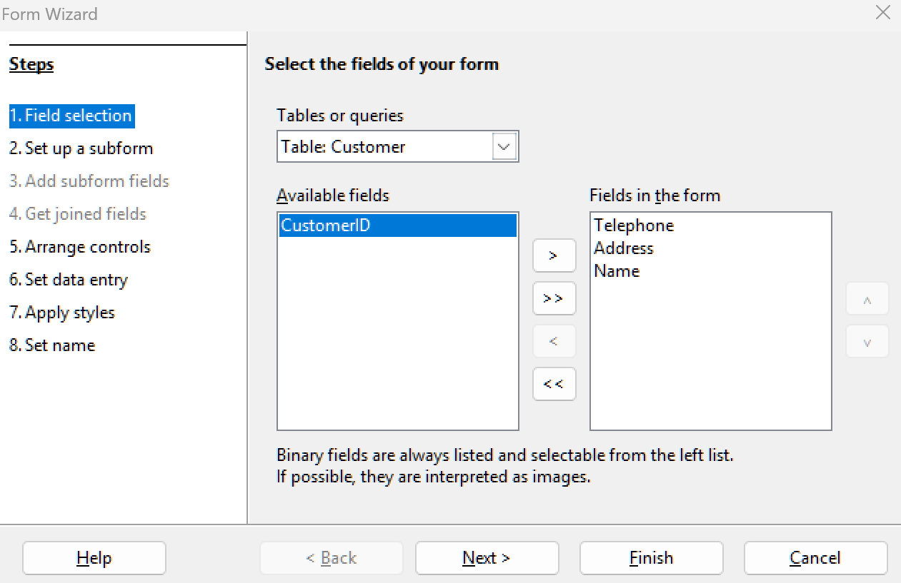
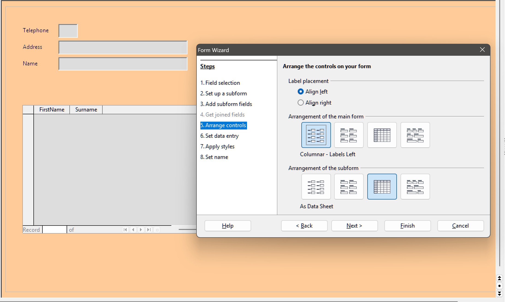
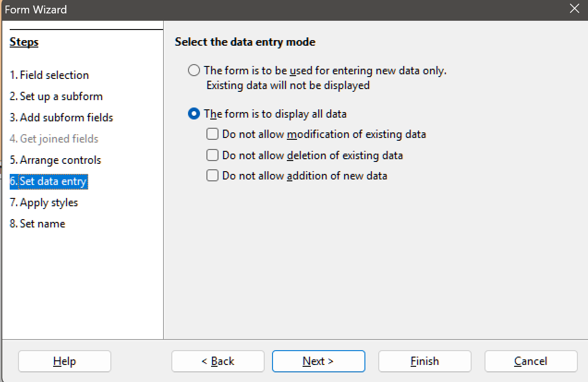
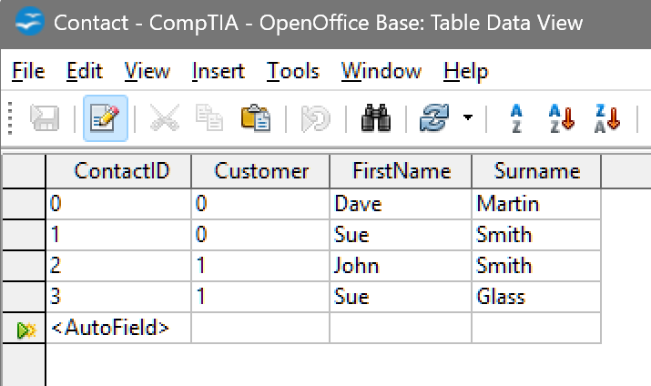

# Lab

## Overview

In this exercise, you will populate the database with sample records using a simple form.

## Instructions

1. With the CompTIA database open, click the **Forms** button.

2. In the **Tasks** list, click **Use Wizard to Create Form**.

3. In the **Form Wizard**, in the **Tables or Queries** list, select **Table: Customer**.

4. In the **Available fields** list, select **Name**, **Address**, and **Telephone**, then click the `>` button.

   

   > Creating a form with the wizard

   As the **ID** field is automatically generated for each new record, it does not need to be added to the form.

5. Click **Next**.

6. Check the **Add Subform** box and select the **Subform based on existing relation** option. Select **Contact**.

7. Click **Next**.

8. Add the **FirstName** and **Surname** fields, then click **Next**.

9. On the **Arrange controls** tab, under **Arrangement of the main form**, click the **Columnar – Labels Left** icon.

   Under **Arrangement of the subform**, click **As Data Sheet**.

   

   > Defining the form & subform layout

10. Click **Next**.

    

    > Adding a subform

    Forms can be configured to view only or with properties to prevent modification, addition, or deletion of data.

11. Leave the defaults selected and click **Next**.

12. Click **Next** twice to accept the default style and name.

13. Select **Work with the form** and click **Finish**.

14. In the open form, type the following data in the appropriate fields:

    - **Name**: Widget
    - **Address**: 123 Address Street
    - **Telephone**: 9990001111

15. Click in the subform data sheet and enter the following information:

    - **FirstName**: Dave
    - **Surname**: Martin

16. Type the following data in the next row:

    - **FirstName**: Sue
    - **Surname**: Smith

17. Click back in the main form (in the **Name** field, for instance), then click the **New Record** button.

18. In the open form, type the following data in the appropriate fields:

    - **Name**: Grommet
    - **Address**: 321 Main Road
    - **Telephone**: 8880002222

19. Click in the subform data sheet and enter one or two contacts.

20. Close the current form.

21. In the database window, select the **Tables** object. Open the **Customer** table. Make a note of the values in the **CustomerID** primary key field for the two records:

    - **Widget**: \_\_\_\_\_\_\_\_\_\_\_\_\_\_\_\_\_\_\_\_\_\_
    - **Grommet**: \_\_\_\_\_\_\_\_\_\_\_\_\_\_\_\_\_\_\_\_\_\_

22. Close the table.

23. Open the **Contact** table and check the **Customer** field. You should see the values you recorded above entered in the foreign key.

    

    > Values added to the Contact table foreign key Customer field

    These values are added automatically by the database engine because of the relationship you defined between the tables and between the form and subform.

24. Close the **Contact** table.
