# Module 1 / Using Computers <!-- omit in toc -->

### Table of Contents <!-- omit in toc -->

- [1. Common Computing Devices](#1-common-computing-devices)
  - [1.1. Information Technology](#11-information-technology)
    - [1.1.1. Computer Hardware and Software](#111-computer-hardware-and-software)
    - [1.1.2. Basics of Computing and Processing](#112-basics-of-computing-and-processing)
    - [1.1.3. Input, Output, Processing, and Storage](#113-input-output-processing-and-storage)
  - [1.2. Personal Computers](#12-personal-computers)
    - [1.2.1. Desktop and Workstation Computers](#121-desktop-and-workstation-computers)
    - [1.2.2. Servers](#122-servers)
    - [1.2.3. Laptops](#123-laptops)
    - [1.2.4. PC and Laptop Vendors](#124-pc-and-laptop-vendors)
  - [1.3. Mobile Devices](#13-mobile-devices)
    - [1.3.1. Smartphones and Tablets](#131-smartphones-and-tablets)
  - [1.4. Internet of Things Devices](#14-internet-of-things-devices)
    - [1.4.1. Home Automation](#141-home-automation)
    - [1.4.2. Modern Cars and Drones](#142-modern-cars-and-drones)
    - [1.4.3. Medical Devices](#143-medical-devices)
    - [1.4.4. Gaming Consoles](#144-gaming-consoles)
- [2. Using a Workstation](#2-using-a-workstation)
  - [2.1. Setting up a PC System](#21-setting-up-a-pc-system)
    - [2.1.1. Setting up a Personal Computer](#211-setting-up-a-personal-computer)
    - [2.1.2. Setting up a Laptop](#212-setting-up-a-laptop)
  - [2.2. Ergonomic Concepts](#22-ergonomic-concepts)
    - [2.2.1. Proper Keyboard and Mouse Placement](#221-proper-keyboard-and-mouse-placement)
    - [2.2.2. Sitting Position and Monitor Placement](#222-sitting-position-and-monitor-placement)
  - [2.3. Navigating an OS](#23-navigating-an-os)
    - [2.3.1. Signing in to Windows](#231-signing-in-to-windows)
    - [2.3.2. Using the Desktop and Taskbar](#232-using-the-desktop-and-taskbar)
    - [2.3.3. Using the Start Screen](#233-using-the-start-screen)
    - [2.3.4. Customizing the Start Screen and Taskbar](#234-customizing-the-start-screen-and-taskbar)
  - [2.4. Using Input Devices](#24-using-input-devices)
    - [2.4.1. Using a Mouse or Touchpad](#241-using-a-mouse-or-touchpad)
    - [2.4.2. Using a Keyboard](#242-using-a-keyboard)
    - [2.4.3. Using a Touchscreen](#243-using-a-touchscreen)
  - [2.5. Recognizing Desktop Icons](#25-recognizing-desktop-icons)
  - [2.6. Working with Windows](#26-working-with-windows)
- [3. Using an OS](#3-using-an-os)
  - [3.1. Functions of an Operating System](#31-functions-of-an-operating-system)
    - [3.1.1. Interface Between User and Computer](#311-interface-between-user-and-computer)
    - [3.1.2. Interface Applications and Hardware](#312-interface-applications-and-hardware)
    - [3.1.3. System Health and Functionality](#313-system-health-and-functionality)
    - [3.1.4. Data Management](#314-data-management)
  - [3.2. Types of Operating Systems](#32-types-of-operating-systems)
    - [3.2.1. Workstation, Server, and Mobile Device OS](#321-workstation-server-and-mobile-device-os)
    - [3.2.2. Open Source vs Commercial](#322-open-source-vs-commercial)
    - [3.2.3. Embedded OS](#323-embedded-os)
    - [3.2.4. **3.2.4. Firmware**](#324-324-firmware)
  - [3.3. Virtualization](#33-virtualization)
  - [3.4. Microsoft Windows](#34-microsoft-windows)
    - [3.4.1. Windows 10](#341-windows-10)
    - [3.4.2. Older Windows Versions](#342-older-windows-versions)
    - [3.4.3. Windows Editions](#343-windows-editions)
    - [3.4.4. 64-bit Windows](#344-64-bit-windows)
    - [3.4.5. Windows 10 Mobile](#345-windows-10-mobile)
  - [3.5. Apple macOS and iOS](#35-apple-macos-and-ios)
    - [3.5.1. Apple Mac OS / OS X / macOS](#351-apple-mac-os--os-x--macos)
    - [3.5.2. Apple iOS](#352-apple-ios)
  - [3.6. Linux, Chrome, \& Android](#36-linux-chrome--android)
    - [3.6.1. Chrome OS](#361-chrome-os)
    - [3.6.2. Android](#362-android)
  - [3.7. File Explorer](#37-file-explorer)
    - [3.7.1. File Explorer / Windows Explorer](#371-file-explorer--windows-explorer)
    - [3.7.2. This PC](#372-this-pc)
    - [3.7.3. Network](#373-network)
  - [3.8. Windows Settings \& Control Panel](#38-windows-settings--control-panel)
    - [3.8.1. Windows Settings](#381-windows-settings)
    - [3.8.2. Control Panel](#382-control-panel)
    - [3.8.3. Ease of Access Options](#383-ease-of-access-options)
    - [3.8.4. Advanced Management Utilities](#384-advanced-management-utilities)
  - [3.9. Using a Web Browser](#39-using-a-web-browser)
    - [3.9.1. Opening a Webpage](#391-opening-a-webpage)
    - [3.9.2. URLs, Websites, and Hyperlinks](#392-urls-websites-and-hyperlinks)
    - [3.9.3. User Browser Controls](#393-user-browser-controls)
    - [3.9.4. Setting the Home Page](#394-setting-the-home-page)
- [4. Managing an OS](#4-managing-an-os)
  - [4.1. Management Interfaces](#41-management-interfaces)
  - [4.2. Process \& Service Management](#42-process--service-management)
    - [4.2.1. Task Manager](#421-task-manager)
    - [4.2.2. Service Management](#422-service-management)
    - [4.2.3. Task Scheduler](#423-task-scheduler)
  - [4.3. Memory \& Disk Management](#43-memory--disk-management)
    - [4.3.1. Memory Management](#431-memory-management)
    - [4.3.2. Virtual Memory / Pagefile](#432-virtual-memory--pagefile)
    - [4.3.3. Disk Management](#433-disk-management)
    - [4.3.4. Command Line Interfaces](#434-command-line-interfaces)
  - [4.4. Access control \& Protection](#44-access-control--protection)
    - [4.4.1. Administrator \& Standard User Accounts](#441-administrator--standard-user-accounts)
    - [4.4.2. Least Privilege \& User Account Control](#442-least-privilege--user-account-control)
    - [4.4.3. Creating Other User Accounts](#443-creating-other-user-accounts)
    - [4.4.4. Managing User Accounts](#444-managing-user-accounts)
- [5. Troubleshooting \& Support](#5-troubleshooting--support)
  - [5.1. Support \& Troubleshooting](#51-support--troubleshooting)
  - [5.2. CompTIA Troubleshooting Model](#52-comptia-troubleshooting-model)
  - [5.3. Identifying the Problem](#53-identifying-the-problem)
    - [5.3.1. Question Users \& Determine Changes](#531-question-users--determine-changes)
    - [5.3.2. Duplicate the Problem and Identify Symptoms](#532-duplicate-the-problem-and-identify-symptoms)
    - [5.3.3. Approach Multiple Problems Individually](#533-approach-multiple-problems-individually)
    - [5.3.4. Gather Information \& Research Symptoms](#534-gather-information--research-symptoms)
  - [5.4. Understanding the Problem](#54-understanding-the-problem)
    - [5.4.1. Question the Obvious](#541-question-the-obvious)
    - [5.4.2. Divide \& Conquer](#542-divide--conquer)
    - [5.4.3. Consider Multiple Approaches](#543-consider-multiple-approaches)
    - [5.4.4. Test the Theory and Escalate the Problem](#544-test-the-theory-and-escalate-the-problem)
  - [5.5. Resolving \& Documenting the Problem](#55-resolving--documenting-the-problem)
    - [5.5.1. Establish a Plan of Action](#551-establish-a-plan-of-action)
    - [5.5.2. Implement the Solution](#552-implement-the-solution)
    - [5.5.3. Verify Full System Functionality \& Implement Preventive Measures](#553-verify-full-system-functionality--implement-preventive-measures)
    - [5.5.4. Document Findings, Actions, \& Outcomes](#554-document-findings-actions--outcomes)
  - [5.6. Troubleshooting PC Issues](#56-troubleshooting-pc-issues)
  - [5.7. Getting Support](#57-getting-support)
    - [5.7.1. Windows Help \& Tips](#571-windows-help--tips)
    - [5.7.2. Contacting Technical Support](#572-contacting-technical-support)
    - [5.7.3. Technical Community Groups](#573-technical-community-groups)
  - [5.8. Recommended Support Sites](#58-recommended-support-sites)
  - [5.9. Using a Search Engine](#59-using-a-search-engine)
  - [5.10. Search Selection Criteria](#510-search-selection-criteria)

### 0.0.1. Domain Objectives

| Domain                               | Objectives / Examples                                                                                                                                                                                                                                                                                                                                                                                                                                                                                                                                                                                                                                                                                                                                                                                                                                                                                                                                                             |
| ------------------------------------ | --------------------------------------------------------------------------------------------------------------------------------------------------------------------------------------------------------------------------------------------------------------------------------------------------------------------------------------------------------------------------------------------------------------------------------------------------------------------------------------------------------------------------------------------------------------------------------------------------------------------------------------------------------------------------------------------------------------------------------------------------------------------------------------------------------------------------------------------------------------------------------------------------------------------------------------------------------------------------------- |
| Unit 1 / Common Computing Devices    | **1.3 Illustrate the basics of computing and processing.**  • Input   • Processing   • Output   • Storage                                                                                                                                                                                                                                                                                                                                                                                                                                                                                                                                                                                                                                                                                                                                                                                                                                                             |
|                                      | **2.6 Compare and contrast common computing devices and their purposes.**   • Mobile phones   • Tablets   • Laptops   • Workstations   • Servers   • Gaming consoles   • IoT   (Home appliances, Home automation devices, Thermostats, Security systems, Modern cars, IP cameras, Streaming media devices, Medical devices)                                                                                                                                                                                                                                                                                                                                                                                                                                                                                                                                                                                                                               |
| Unit 3 / Using an OS                 | **3.1 Explain the purpose of operating systems.**   • Interface between applications and hardware   • Types of OS   (Mobile device OS, Workstation OS, Server OS, Embedded OS, Firmware, Hypervisor - Type 1)                                                                                                                                                                                                                                                                                                                                                                                                                                                                                                                                                                                                                                                                                                                                                            |
| Unit 4 / Managing an OS              | **3.1 Manage applications and software**   • Disk management   • Process management/scheduling   (Kill process/end task)   • Memory management   • Access control/protection                                                                                                                                                                                                                                                                                                                                                                                                                                                                                                                                                                                                                                                                                                                                                                                       |
|                                      | **3.2 Compare and contrast components of an operating system.**   • Services   • Processes   • Utilities   (Task scheduling)   • Interfaces   (Console/command line, GUI)                                                                                                                                                                                                                                                                                                                                                                                                                                                                                                                                                                                                                                                                                                                                                                                       |
| Unit 5 / Troubleshooting and Support | **1.6 Explain the troubleshooting methodology.**   • Identify the problem   (Gather information, Duplicate the problem, if possible, Question users, Identify symptoms, Determine if anything has changed, Approach multiple problems individually)   • Research knowledge base/Internet, if applicable   • Establish a theory of probable cause   (Question the obvious, Consider multiple approaches, Divide and conquer)   • Test the theory to determine the cause   (Once the theory is confirmed \[confirmed root cause], determine the next steps to resolve the problem, If the theory is not confirmed, establish a new theory or escalate)   • Establish a plan of action to resolve the problem and identify potential effects   • Implement the solution or escalate as necessary   • Verify full system functionality and, if applicable, implement preventive measures   • Document findings/lessons learned, actions and outcomes |

# 1. Common Computing Devices

**Objectives**:

On completion of this unit, you will be able to:

- describe the basics of how a computer processes data.
- describe the functions and capabilities of types of computing devices, such as PCs, servers, mobiles, and home automation.

## 1.1. Information Technology

- **IT system**: processes, stores, transfers data represented in \*\* \_binary \_\*\*
- **ICT**: emphasizes communication in IT, e.g., global internet.

> **Binary**: a numerical system that uses only two digits, 0 and 1, to represent data. Computers process and store information in binary format.

### 1.1.1. Computer Hardware and Software

- **computer system elements**: hardware, software, user.
- **hardware**: components within the case and peripherals (input/output devices).
- **software**: OS for basic functionality, applications for tasks, provides user interface.

### 1.1.2. Basics of Computing and Processing

- **interface**: connects hardware and software.
- **execution pathway**: user input → OS converts commands → stored in **RAM** → **CPU** processes → CPU writes results back to memory and directs other components to perform actions.
- **binary data**: instructions computers process as **strings** of 1s and 0s.

  - these 1s and 0s represent the on and off states of switches called transistors, located in the CPU and RAM.

### 1.1.3. Input, Output, Processing, and Storage

1. **input**: data entered by users via devices (keyboard, mouse).
2. **processing**: data written to memory and manipulated by CPU.
3. **output**: results displayed (monitor, speaker).
4. **storage**: data saved permanently on hard drives or temporarily in RAM.

> Most computers are connected to networks to exchange data. **Networking** can be seen as a unique form of input and output but is best understood as a separate function.

## 1.2. Personal Computers

The IBM PC, introduced in 1981, was built around a microprocessor, or **CPU**, developed by Intel. This design became the foundation for what is now known as the IBM x86 architecture or platform.

### 1.2.1. Desktop and Workstation Computers

A **workstation** is defined by high-performance desktops, often used for specialized tasks. Can be used as a **network client**

**performance factors**:

- CPU speed
- RAM (makes it possible to run more applications simultaneously and process large amounts of data)
- storage capacity (amount of data stored when turned off)
- peripherals (e.g., webcams, sound cards).
- upgradability

> The main storage drive also has a big impact on system speed. Legacy hard drives were a serious performance bottleneck, but these are being replaced by solid state drives, which can work much more quickly.

### 1.2.2. Servers

A **server** (often housed in racks) provides services to multiple users in a network, usually comprised of redundant components making it **fault-tolerant**.

> The term server can refer to both hardware and software. A hardware server can host multiple software servers, such as web, email, database, or authentication servers.

### 1.2.3. Laptops

Laptops are portable computers with integrated components like a display, keyboard, and touchpad, designed for mobility and versatile computing across various environments.

**features**:

- integrated display
- system components within a portable case (chassis).

**networking**:

- wireless radio technologies (Wi-Fi).

**types**:

- notebooks
- ultrabooks
- hybrids (laptop/tablet).

### 1.2.4. PC and Laptop Vendors

Most PC and laptop brands are **original equipment manufacturers (OEMs)** i.e they source components from manufacturers.

The hardware for **Chromebooks** is manufactured by various OEMs like HP, Dell, Lenovo, and Acer (IBM compatible vendors).

Apple Inc. (OEM) produces **Macintosh computers** with its Mac OS and unique hardware platform, differing from IBM PC-compatible vendors.

## 1.3. Mobile Devices

Personal devices like smartphones and tablets have replaced many PC and laptop functions.

### 1.3.1. Smartphones and Tablets

Smartphones function like PCs but are handheld, with modern touchscreen interfaces for ease of use.

- Evolved from **PDAs** and early **feature phones** with limited functionality.

## 1.4. Internet of Things Devices

The **Internet of Things (IoT)** connects everyday objects with embedded processing and networking capabilities.

**Examples**: Motor vehicles, washing machines, smart appliances, and even clothing.

### 1.4.1. Home Automation

Smart devices like thermostats, IP cameras, and streaming media can be managed via **home automation software**.

- Often controlled through a central **hub**.
- Other networking standards:

  - _Wi-Fi_
  - _Z-Wave_
  - _ZigBee_
  - _Bluetooth LE_.

### 1.4.2. Modern Cars and Drones

Cars increasingly feature electronic systems:

- **Navigation**
- **entertainment**
- **anti-collision**
- **autonomous driving**
- **Drones (UAVs)** are also a growing sector with similar advanced technology.

### 1.4.3. Medical Devices

Medical devices now include portable electronics for remote monitoring and adjustment

- **Cardiac monitors/defibrillators**
- **Insulin pumps**

> These innovations reduce the need for in-person care visits.

### 1.4.4. Gaming Consoles

Gaming consoles share components with workstations, such as powerful CPUs and GPUs, but are designed for gaming pad control.

- Examples include handheld consoles like **Nintendo Switch** and **Sony Vita**, with Wi-Fi for connectivity.

# 2. Using a Workstation

**Objectives:**

- Set up a computer system with regard for safety and healthy working practices.
- Navigate an OS and use input devices effectively.

## 2.1. Setting up a PC System

When setting up a PC, consider the following:

- **Environment:** Keep the area free of dust, dirt, heat, or dampness, as these can damage components.
- **Safety:** Avoid electrical or trip hazards, ensuring cables are secured and organized.
- **Health:** Use ergonomic practices to prevent strain or injury during prolonged use.

### 2.1.1. Setting up a Personal Computer

1. Unbox the PC, let it adjust to room temperature for 30–60 minutes, and read the manual.
2. Position components with proper ventilation, secure placement, and minimal glare or sunlight exposure.
3. Adjust the monitor, chair, mouse, and keyboard for user comfort.
4. Connect peripherals and inspect cables for damage. Use cable management features for safety.
5. Connect power cables and ensure outlets aren’t overloaded. Turn on the peripherals and system unit.

### 2.1.2. Setting up a Laptop

- Insert and charge the battery using the AC adapter before first use.
- Follow the manual to set up the device and peripherals, if needed.
- Open the lid, press the power button, and start using the system.

## 2.2. Ergonomic Concepts

Ergonomic concepts focus on designing workspaces and tools to maximize comfort and efficiency while minimizing strain or injury. Proper posture, workstation setup, and frequent breaks are key principles to ensure long-term health and productivity.

### 2.2.1. Proper Keyboard and Mouse Placement

- Avoid repetitive strain injuries (RSI) by:

  - Keeping wrists straight while typing or using a mouse.
  - Resting your palm on the mouse and keeping forearms parallel to the keyboard.
  - Take regular breaks to stretch and prevent fatigue.

### 2.2.2. Sitting Position and Monitor Placement

- Sit upright with feet flat on the floor and thighs parallel to the ground.
- Adjust the monitor so the top is at or slightly below eye level.
- Use a supportive chair for your back and neck, and avoid hunching forward.
- Take breaks to stretch and move.

## 2.3. Navigating an OS

Learning to navigate an operating system is essential for managing files, applications, and system settings. Whether using a graphical user interface (GUI) or command-line tools, understanding the basic structure and navigation commands will enhance your efficiency and productivity.

### 2.3.1. Signing in to Windows

1. Select your account from the sign-in screen.
2. Enter your password (case-sensitive) and press **Enter** to log in.
3. Configure **Windows Hello** for biometric sign-ins like fingerprint or facial recognition if supported.

### 2.3.2. Using the Desktop and Taskbar

- **Desktop**: Contains shortcut icons for apps, files, and folders.
- **Taskbar**: Used to manage open windows, switch between apps, and pin frequently used programs.

  - The notification area displays system icons like battery, volume, and network.

### 2.3.3. Using the Start Screen

- Access apps and settings from the Start button.
- In tablet mode, the Start screen appears full-screen; otherwise, it displays as a menu.
- Launch programs by typing their name in the **Search** box.

### 2.3.4. Customizing the Start Screen and Taskbar

- Right-click tiles or pinned items to resize, move, or unpin them.
- Organize tiles into groups and name them.
- Use **Settings > Personalization** to configure taskbar and Start menu behavior.

## 2.4. Using Input Devices

Input devices are your gateway to interacting with a computer, from typing on a keyboard to clicking with a mouse or swiping on a touchscreen. Understanding how to use these devices effectively can enhance your productivity and streamline your tasks. This section explores the basics of input devices, tips for optimal use, and how to troubleshoot common issues.

### 2.4.1. Using a Mouse or Touchpad

- Point and click to select items; double-click to open them.
- Use the scroll wheel to navigate within windows.
- For drag-and-drop, hold down the button while moving the cursor.

### 2.4.2. Using a Keyboard

- Learn touch-typing to improve speed and comfort.
- Use special keys like **Ctrl**, **Alt**, and **Shift** for shortcuts.
- **Function keys** (F1, F2, etc.) perform specific tasks in apps.

### 2.4.3. Using a Touchscreen

- Tap to select, swipe to navigate, and pinch/stretch to zoom.
- Gestures like swiping from edges perform system actions (e.g., showing notifications).

## 2.5. Recognizing Desktop Icons

- **File icons**: Represent data files, often showing the associated application.
- **Shortcut icons**: Links to files or programs, marked with an arrow.
- **Folder icons**: Used for organizing files.
- **Application icons**: Represent installed software.

## 2.6. Working with Windows

- **Managing windows**:

  - Use the taskbar to switch between open windows or resize and arrange them.
  - Use "snap" to position windows side-by-side or maximize them.

- **Closing windows**: Free up resources by exiting programs when done.

- **Multitasking**: Use shortcuts like **Alt + Tab** to switch quickly between apps.

# 3. Using an OS

**Objectives:**

- Distinguish between different types of operating systems designed for workstations, servers, mobiles, embedded systems, and virtualization.
- Identify commonly used commercial and open source operating systems, such as Windows, macOS, iOS, Linux, Chrome, and Android.
- Use a browser to view websites.

## 3.1. Functions of an Operating System

An **Operating System (OS)** provides an interface between the **hardware, applications, programs, and the user**, ensuring smooth interaction and functionality.

### 3.1.1. Interface Between User and Computer

An **Operating System** provides a **shell** as an interface between the user and computer:

- **Graphical User Interface (GUI)**: Uses windows, icons, menus, and pointing devices (WIMP).

  - Early OS examples like Microsoft's **Disk OS (DOS)** relied on command-line interfaces or simple menus.
  - Modern GUIs introduced intuitive interactions, though some DOS applications also presented graphical elements.

- **Command Line Shell**: Allows users to execute text-based commands, complementing graphical shells.

### 3.1.2. Interface Applications and Hardware

The operating system (OS) acts as the **driver** or **interface** that enables hardware to function and interact with software.

- The OS uses a **kernel** for core functions, **drivers** to manage hardware, and **system utilities** for additional tasks.
- Each hardware component requires a specific driver that the OS identifies and loads automatically.
- **32-bit vs. 64-bit Systems**:

  - A fundamental difference in computer systems is the _size_ of instructions the CPU can process

    - **64-bit CPUs** can process larger instructions and address more memory than 32-bit CPUs.
    - A **64-bit CPU** can run either 64-bit or 32-bit OS and applications.
    - A **32-bit CPU** is limited to 32-bit OS and applications only.

An OS provides a **common environment** where different software applications can run.

> Application developers can "call" OS functions to perform tasks like accessing the hard disk or printing, without needing to write hardware-specific routines.

### 3.1.3. System Health and Functionality

Key OS tools for maintaining system health and performance:

- **Logs**: Record system events or trigger alerts.
- **Performance Monitoring**: Identify overworked components, faulty drivers, or problematic applications, helping users determine if upgrades or repairs are needed.

### 3.1.4. Data Management

Utility software also manages storage devices and organizes information:

- **File Types**:

  - Computers store data as files, which can include **executable**, **configuration**, or **data files**.
  - Users create data files in different formats using various software applications.

- **Persistent Storage**:

  - Files are saved to long-term storage, such as a hard disk.

- **Directory Structure**:

  - The OS organizes files into directories (folders), enabling users to:

    - Create, move, or copy files.
    - Maintain an organized file system.

  _(These tools help users effectively manage data and storage devices.)_

## 3.2. Types of Operating Systems

While they share the same basic functions, there are many different types of operating systems. These support different commercial models and types of devices.

### 3.2.1. Workstation, Server, and Mobile Device OS

A **workstation OS** runs a traditional desktop PC / laptop
Examples include:

- **Windows**
- **Apple OS X / macOS**
- **Linux**: **Chrome OS**

The market for workstation OSs is divided into three main sections:

1. **Enterprise Client**:

   - Designed to work as a client in business networks.

2. **Network Operating System (NOS)** or **server OS**:

   - Designed to run on servers in business networks.

3. **Home Client**:

   - Designed to work on standalone or workgroup PCs and laptops in homes or small offices.
   - Allows clients to run basic _peer-to-peer_ network services, such as file sharing.

A **mobile device OS** is designed & locked for handheld devices.
Examples include:

- **Apple iOS**
- **Android**

A **server OS** runs on servers and is often based on similar code to its workstation OS counterpart. For instance:

- **Windows 10** and **Windows Server 2016** share a similar OS kernel.

A **server OS** typically includes:

- Software packages (or roles) to run **network services**.
- Licensing to support more users.
- Simplified command-line interfaces for enhanced security and performance.

### 3.2.2. Open Source vs Commercial

A commercial OS means that the user must purchase a license to install and use the software. The programming code is kept a secret by the developer. (Windows, iOS, etc.)

**Open Source** means that the programming code is freely available.

- developers are free to make changes so long as they make those changes available in turn.

> Unix, Linux, and Android are examples of open source operating systems.

### 3.2.3. Embedded OS

In general-purpose computer systems, like workstations, laptops, or servers, the OS can usually be deleted and replaced.

An **embedded system**, however, is designed for specific functions, such as:

- A microcontroller in an intravenous drip-rate meter.
- An industrial system managing a water treatment plant.
- Home automation hubs, smart TVs, and gaming consoles, which offer more customization options (e.g., downloading apps, configuring network connectivity).

  _(Embedded systems often control devices performing time-sensitive tasks. Embedded systems cannot tolerate crashes or reboots and demand precise response times. They frequently use specialized platforms known as Real-Time Operating Systems (RTOS))_

### 3.2.4. **3.2.4. Firmware**

The embedded **OS** functions as **firmware**, managing interactions with device hardware.

Unlike regular software, **firmware** is **not designed** for frequent updates. It plays a crucial role in enabling the **OS** to load and control system components on a PC.

There are two main types of **PC firmware**:

1. **Basic Input/Output System (BIOS)**:

   - Industry standard.
   - Manages essential system components.
   - Ensures motherboard compatibility with PCs.

2. **Unified Extensible Firmware Interface (UEFI)**:
   - Used in newer **motherboards**.
   - Can operate in **legacy BIOS mode**.
   - Provides **enhanced boot security**.

**BIOS supports booting for**:

- **64-bit CPU operations**:  
  BIOS enables the system to boot and function with a **64-bit processor**, allowing the operating system to take full advantage of modern 64-bit CPUs. This includes the ability to handle larger amounts of **RAM** and enhance overall performance compared to 32-bit systems.

**UEFI supports booting for**:

- **GUI and mouse usage**:  
  UEFI enhances the boot process by enabling a **graphical user interface (GUI)**, allowing users to interact with boot menus and settings using a **mouse**. This modern interface makes it easier to navigate system options and recovery tools, compared to the traditional text-based BIOS interface.

> [!NOTE]
> Some PC components, such as **graphic adapters**, **storage devices**, and **network controllers**, include their own firmware. **Peripheral devices** and **network equipment**, such as **internet routers** and **wireless access points**, also run on firmware.)\*

## 3.3. Virtualization

previously with microcomputers, a single computer could run only one OS, where all applications shared a common environment.

**Virtualization** means that multiple operating systems can be installed and run simultaneously on a single computer.

A virtual platform requires at least three **components**:

1. **Computer(s)**: The physical machine (or host) that provides the resources (CPU and memory) for the virtual environment.

2. **Hypervisor (or Virtual Machine Monitor \[VMM])**: Manages the virtual machine and handles interaction with the host hardware and network / virtual machines.
   There are two main classes of **hypervisor**:

   - A **Type I (or "bare metal")** hypervisor is installed _directly_ on the computer and interacts _directly_ with its hardware.

   - A **Type II hypervisor** runs as a **software application** within a host OS.

   > Since the host operating system retains direct control of the hardware, the type II hypervisor must request hardware access through the host OS.

3. **Guest Operating Systems (or Virtual Machines \[VM])**:

   - These are isolated OSs running in a virtual environment, these VMs think they have their own dedicated hardware.

   - Their number is limited by the host's hardware and hypervisor restrictions.

   > While Virtual Machines can network together, direct data sharing via the hypervisor is rare for security reasons

Virtualization is generally used on network servers to utilize the hardware more efficiently.

VMs can also be used on desktops,some typical uses of desktop virtualization are:

- **Virtual labs**: Create a research lab to analyze viruses, worms, and Trojans.

  > As the malware is contained within the guest OS, it cannot infect the researcher's computer or network.

- **Support Legacy Software Applications**: Older software may not work on an upgraded OS, within a VM, the original OS can be installed and run.

- **Development environment**: Test software applications under different operating systems and resource constraints.

- **Training**: Can create lab environments for students to practice using live operating systems and software.

  > Changes made during the session can be discarded, restoring the original setup for the next user.

Windows 10 Professional and Enterprise editions are bundled with virtualization software ( _Hyper-V_).

Third-party products include _VMware_ and _VirtualBox_.

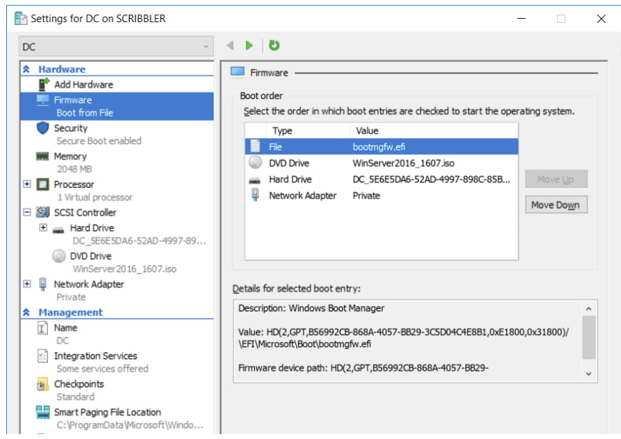

> The hypervisor determines the resources allocated to a virtual machine.

## 3.4. Microsoft Windows

**Microsoft Windows** is the dominant commercial workstation OS, estimated to be installed on 90% of the world's desktop and laptop computers.

The **Windows Server** OS is also widely used on PC servers.

### 3.4.1. Windows 10

Windows will no longer release new versions, but instead maintain Windows 10 with **feature updates**.

- known as _Windows as a service_
- identified with a name and number

  - e.g. _Windows 10 Spring Creators Update (1803)_
  - This number corresponds to the year and month of release

**My current version**:

**Edition** Windows 11 Home

**Version** 24H2

**Installed on** ‎11/‎18/‎2024

**OS build** 26100.2314

**Experience** Windows Feature Experience - Pack 1000.26100.32.0

> My Windows 11 Desktop

### 3.4.2. Older Windows Versions

**Windows 10** succeeded Windows 8/8.1 and addressed user feedback on unpopular interface changes, quickly replacing Windows 8 with a free upgrade.

**Windows 8.1** was a swift update to Windows 8 to fix interface issues; references to Windows 8 generally mean Windows 8.1.

> There was no **Windows 9**.

_Earlier versions include **Windows 7 (2009)**, still widely used (~45% market share), **Vista (2007)**, which saw little adoption, and **XP (2001)**, which remains on ~5% of devices despite no official support._

### 3.4.3. Windows Editions

Windows is released in various editions to target different **markets**: - **Home**: For domestic and small office home office (SOHO) use; cannot join corporate domain networks.

- **Pro**: For small/medium businesses with enhanced networking and management features to allow administrators more control over client devices.
- **Enterprise**: For medium/large enterprises, similar to Pro but with volume licensing options.
- **Education**: Variants of Enterprise and Pro for schools and colleges.

### 3.4.4. 64-bit Windows

Windows is available as **32-bit** or **64-bit** **versions**: - **64-bit Windows**: Runs most 32-bit software but requires 64-bit drivers for hardware.

- requires 64-bit hardware device drivers authorized ("signed") by Microsoft. If no 64-bit driver is available, the hardware device will not be usable.
- **32-bit Windows**: Cannot run 64-bit software.

### 3.4.5. Windows 10 Mobile

Microsoft developed mobile versions like **Windows CE**, **Windows Phone 7/8**, and **Windows 10 Mobile** to unify the codebase across devices. However, these have a small market share compared to **Android** and **iOS**. Microsoft continues to produce smartphones and Surface tablets running Windows 10 Mobile.

## 3.5. Apple macOS and iOS

In 1984, when the IBM PC was the dominant desktop standard, **Steve Jobs** and **Steve Wozniak** created the Apple Macintosh (Mac). It introduced a revolutionary **graphical user interface (GUI)** compared to IBM's command-line DOS operating system. While Macs have not reached Windows' user base, they maintain a loyal following.

### 3.5.1. Apple Mac OS / OS X / macOS

- **Exclusive to Apple Computers**: macOS is only available on Apple-built devices, making it stable but limiting hardware choices.
- **Built on UNIX**: The macOS kernel is derived from UNIX, supplemented with features like the graphical interface and compatibility with older Mac applications.
- **Updates**: Periodic "dot" version updates keep macOS modern and secure.
- **Integration**: Designed to work seamlessly with Apple hardware, enhancing user experience.

### 3.5.2. Apple iOS

- **Purpose**: Operating system for iPhones and iPads.
- **Updates**: Released yearly with free updates. Older devices may not support new features or versions.
- **Closed Source**: iOS is based on UNIX but only modifiable by Apple.
- **Ease of Use**: Simplified navigation with a Home button for easy access to the Home Screen.
- **Popularity**: Its intuitive design and consistent updates make it a leading choice in mobile OS.

## 3.6. Linux, Chrome, & Android

Originally developed by **Linus Torvalds**, Linux is an **open-source alternative to UNIX**, which was proprietary and fragmented across versions.

- **Versatility**: Used as both a desktop and server OS.

- **Distributions (Distros)**: Includes variants like **Ubuntu**, **Mint**, **Red Hat**, and **Fedora**, each offering unique features and support.

- **Applications**: Supported by companies like IBM, Oracle, and Novell.

- **Common Uses**:

  - Desktop **OS**: Popular in educational environments.
  - Server **OS**: Widely used for web hosting.

- **Interface**: Linux can function with or without a graphical interface.

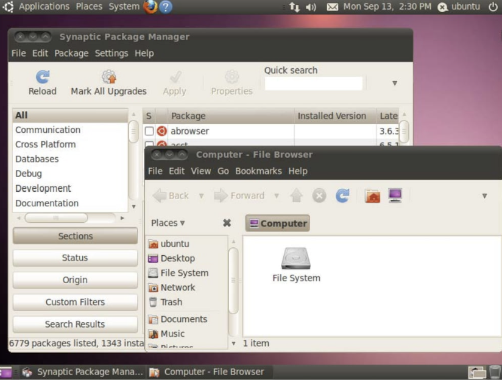

> Ubuntu Linux

### 3.6.1. Chrome OS

- **Derived from Linux**: Built on Chromium OS, an open-source project, but Chrome OS itself is proprietary.
- **Google-Developed**: Designed for Chromebooks and Chromeboxes, targeting budget-conscious users.
- **Web-Focused**: Primarily supports web applications, reducing the need for powerful client devices.
- **Compatibility**: Runs packaged apps for offline use and supports Android apps.
- **Simpler Environment**: Chrome OS minimizes software interference, ensuring smooth browser functionality.

### 3.6.2. Android

- **Purpose**: Open-source smartphone/tablet OS developed by the **Open Handset Alliance**, led by Google.
- **Based on Linux**: Source code is freely available
- **Customization**: Hardware vendors like Samsung, LG, and Huawei create device-specific Android versions.
- **Updates**: Features major (e.g., 1.x) and minor (e.g., x.1) updates, named after desserts.
- **Popularity**: Its open nature allows for wide adoption and device customization.

## 3.7. File Explorer

Once you have learned how to use icons and windows, another crucial step in learning to use an operating system is being able to navigate around the file system.

### 3.7.1. File Explorer / Windows Explorer

**File Explorer** 📁 (formerly Windows Explorer) is the primary file management tool in Microsoft Windows. It enables you **to**: - View, create, rename, and delete folders and files.

> Access files stored on local disks, removable drives, and network locations.

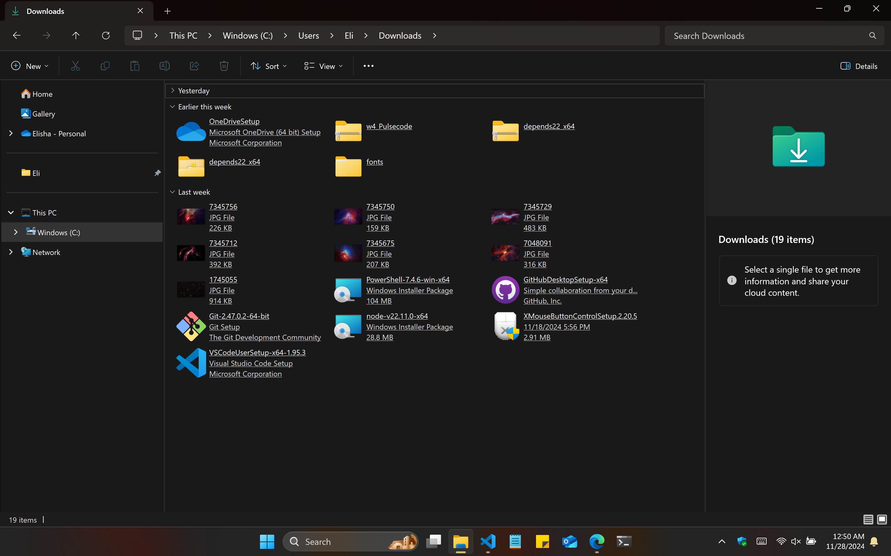

> File Explorer / Downloads

### 3.7.2. This PC

**This PC** 🖥️ represents the local computer. Opening **This PC** provides an Explorer window that **shows**: - Local, removable, and network drives available to the computer.

**Additionally**: - **Right-click** the **This PC** icon for options like:

- **Properties**: Opens System properties for viewing and configuring system settings.
- **Manage**: Opens the Computer Management console for advanced configuration.

### 3.7.3. Network

The **Network** 🌐 object contains shared resources available on connected network servers. These resources can **include**: - Shared folders

- Network printers
- Other network devices

Use the **Properties** shortcut menu for:

- Opening the **Network and Sharing Center** to:

  - View the status of network connections.
  - Configure settings for sharing folders and devices.

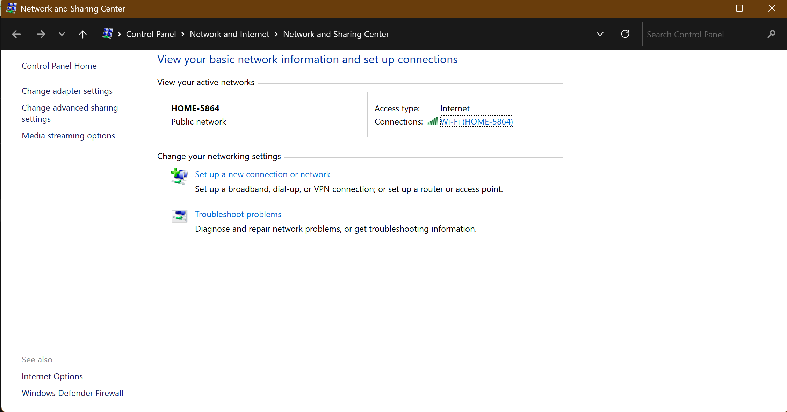

> Network & Sharing Center - Browsing shared devices, printers, and infrastructure on a network using File Explorer.

## 3.8. Windows Settings & Control Panel

Managing your Windows device effectively starts with understanding the **Settings** and **Control Panel**. These tools provide access to a wide range of features, from personalizing your desktop to troubleshooting system issues. Whether you're adjusting your display, configuring your network, or exploring advanced options, this guide will help you navigate and make the most of these essential Windows utilities.

### 3.8.1. Windows Settings

Windows Settings is a touchscreen-friendly app interface for managing most Windows 10 configuration settings. However, not all settings are included in Windows Settings.

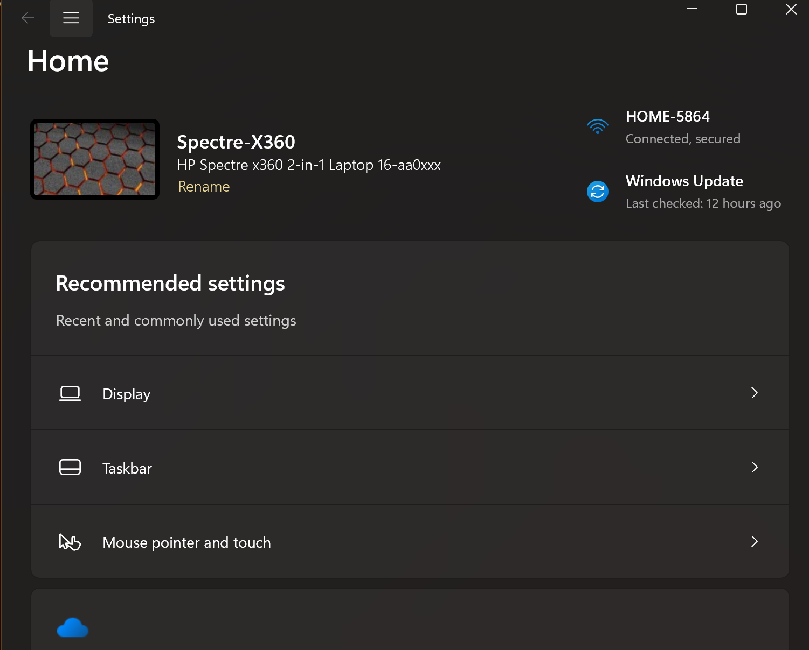

> Windows Settings App Home

### 3.8.2. Control Panel

The **Control Panel** allows users to configure basic Windows settings and manage certain software (e.g., anti-virus).

- In older versions like Windows XP and 7, Control Panel was the default settings interface.
- In Windows 10+, many settings have been migrated to **Windows Settings**.
- Users can display all Control Panel options by using the search box, navigation breadcrumbs, or changing the **View by** option.

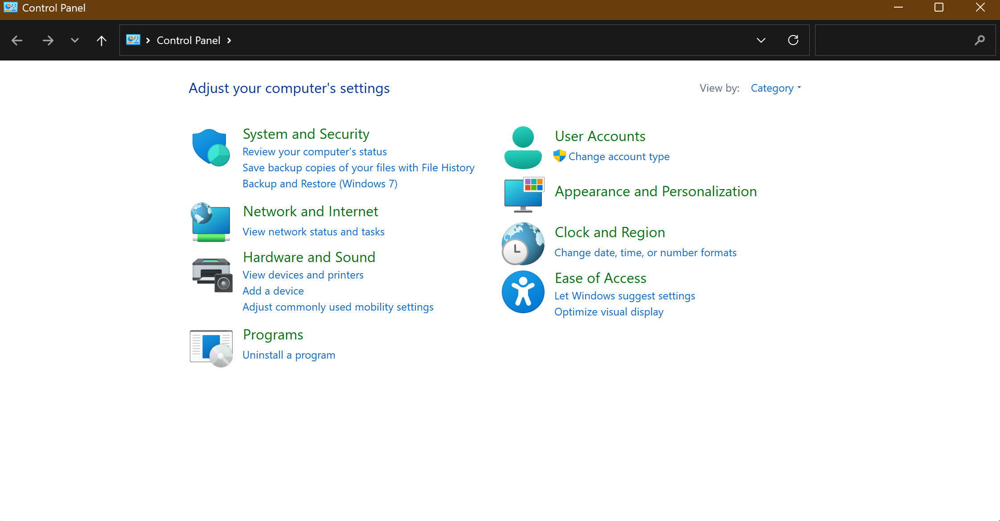

> control panel, showing navigation breadcrumbs, task groups, configuration applets, search box, and view options

### 3.8.3. Ease of Access Options

Ease of Access settings assist users with physical impairments by enabling features such **as**: - Touchscreen support

- Voice control and narration
- On-screen keyboard
- Magnifier and display adjustments

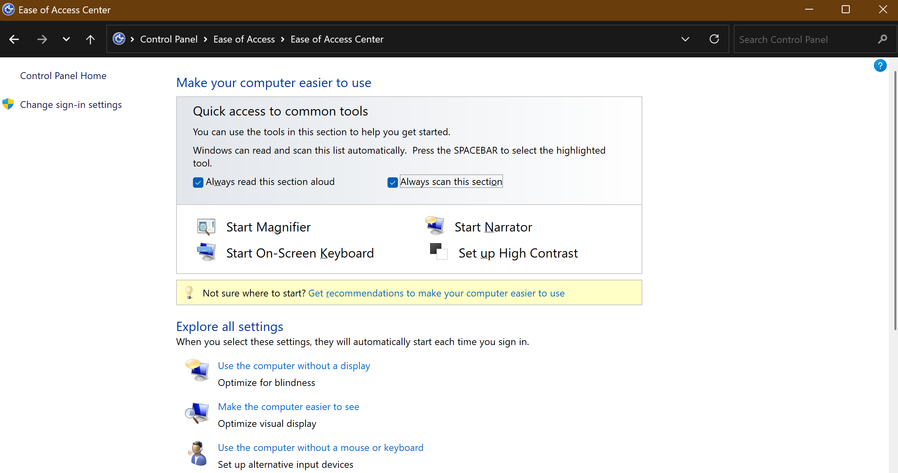

> Use the Ease of Access center to set up accessibility options

### 3.8.4. Advanced Management Utilities

Access advanced system utilities by pressing **START+X** or **right-clicking** the Start button. The shortcut menu includes tools like: - Control Panel and Windows Settings

- File Explorer
- Device Manager
- Command Prompt
- Windows PowerShell

## 3.9. Using a Web Browser

A web browser lets you explore the internet, access websites, and search for information. This section covers the basics and tips to enhance your browsing experience.

### 3.9.1. Opening a Webpage

To browse the Internet, open your browser (e.g., Microsoft Edge, Chrome, Firefox) and type the website address (URL) into the address bar.

- Use **CTRL+T** to open a new tab and **CTRL+TAB** to cycle through open tabs.
- Microsoft Edge is the recommended browser for Windows 10, while Internet Explorer is included for compatibility purposes.

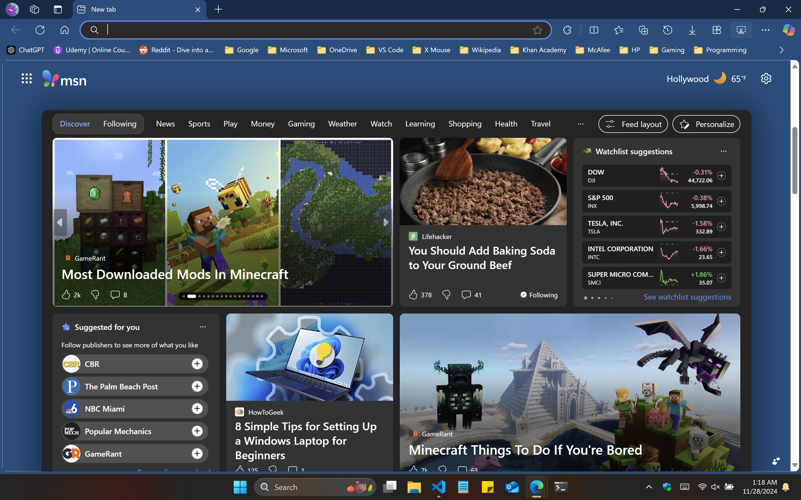

> Microsoft Edge Home Page

### 3.9.2. URLs, Websites, and Hyperlinks

- A **URL (Uniform Resource Locator)** is used to locate web resources, such as [comptia.org/index.htm](http://www.comptia.org/index.htm)
- Modern browsers interpret the `http://` portion automatically, and users can often skip typing "www".
- Websites consist of interconnected pages navigated via hyperlinks.

  - **Hyperlinks** can be text or images and appear as a pointing finger when hovered over.
  - Links can open in the same tab, a new tab, or a different window.

  _By right-clicking a hyperlink, you can choose how it opens. Hyperlinks and navigation bars simplify browsing without requiring users to memorize specific URLs._

### 3.9.3. User Browser Controls

**Back** (`BACKSPACE`):

Returns you to the last page you visited. Clicking the arrow on the button allows you to choose from a list of previously visited pages.

**Forward** (`ALT+RIGHT ARROW`):

Moves you forward to a page after using the Back button. Clicking the arrow lets you skip ahead through multiple pages.

**Stop** (`ESC`):

Stops the loading of a page, useful if a slow connection causes delays.

**Refresh** (`F5`):

Reloads the current page to show the latest version. To bypass cached files and force a full reload, press `CTRL+F5`.

Browsers store visited pages in a cache to save time. If a page seems outdated, using Refresh or `CTRL+F5` ensures the latest version is loaded.

The **address bar** keeps an AutoComplete list of sites you’ve previously typed. Clicking the arrow or typing a partial address displays suggestions, allowing quick access to those pages.

To see a comprehensive list of visited pages, open the browser's **History** using `CTRL+SHIFT+H`.

### 3.9.4. Setting the Home Page

**home page**: the default page that opens when you enter the site's simplest **URL**: `Comptia.com` or `Microsoft.com` for example. You can set your home page in browser settings.

Open your home page by clicking the 🏠 icon, or by pressing `Alt + Home`

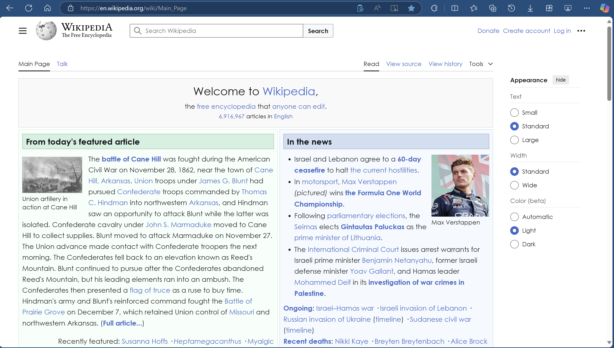

> Wikipedia's Home Page

# 4. Managing an OS

**Objectives**:

- Use GUI and command-line management interfaces to configure an operating system.
- Explain the importance of access control features and configure user accounts.

## 4.1. Management Interfaces

A **management interface** is a graphical or command-line tool used to perform some aspect of system configuration.

- **Control Panel/Windows Settings**: individual applets to configure various aspects of Windows. The Control Panel is a legacy interface; increasingly, configuration options are being moved to the touchscreen-friendly Settings app.

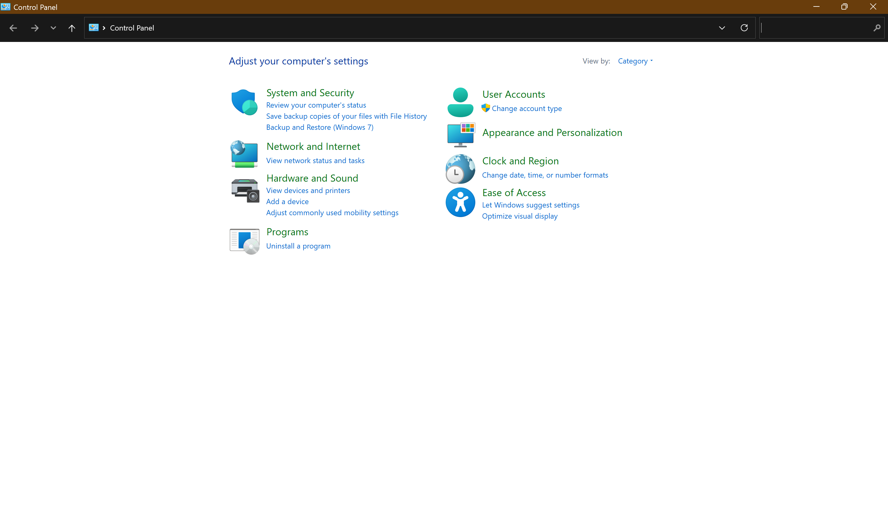

> control panel (`control`)

- **Management Consoles** (): these represent more technical system configuration options. The default Computer Management console contains a number of different administrative **snap-ins**. Each snap-in configures the settings for a different OS sub-system, such as **disk management** or **user management**. There are various other consoles, and you can also create custom ones with `mmc.exe`.

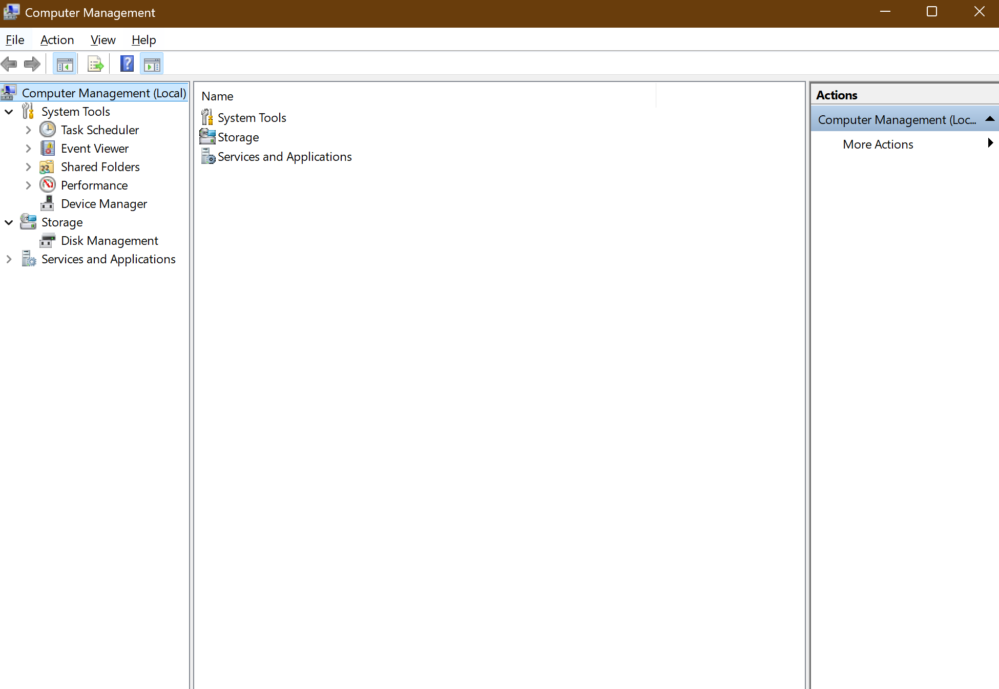

> computer management console `compmgmt.msc`

- **Registry Editor**: when you change a setting via a management interface, you are usually changing something stored in the Windows Registry configuration database. The Registry Editor is a means of directly editing this database.

> registry editor (`regedit`)

- **Command prompt/PowerShell**: settings can also be changed by typing native Windows commands or the PowerShell scripting language.

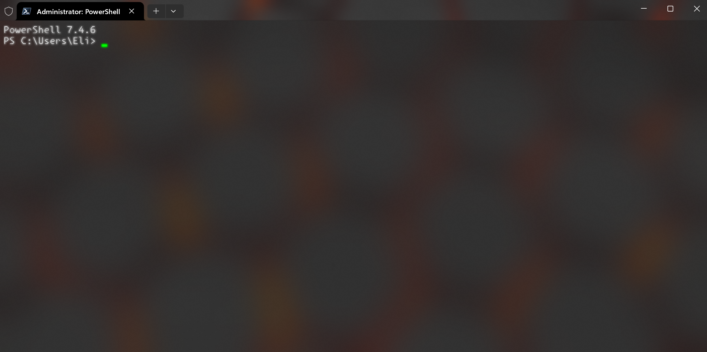

> Powershell 7 (`pwsh.exe`)

## 4.2. Process & Service Management

Managing processes and services is key to keeping your system running smoothly. This section explains how to monitor, optimize, and troubleshoot them effectively.

### 4.2.1. Task Manager

The **task manager (`taskmgr`)** is used to monitor resource usage or terminate unresponsive processes ("kill" a process).

- Administrator rights are needed to end system-level processes.

Always try closing applications normally before force-terminating them.

### 4.2.2. Service Management

A **service** is a background process that doesn't require user interaction

- manages functions like network browsing, user login, or indexing.

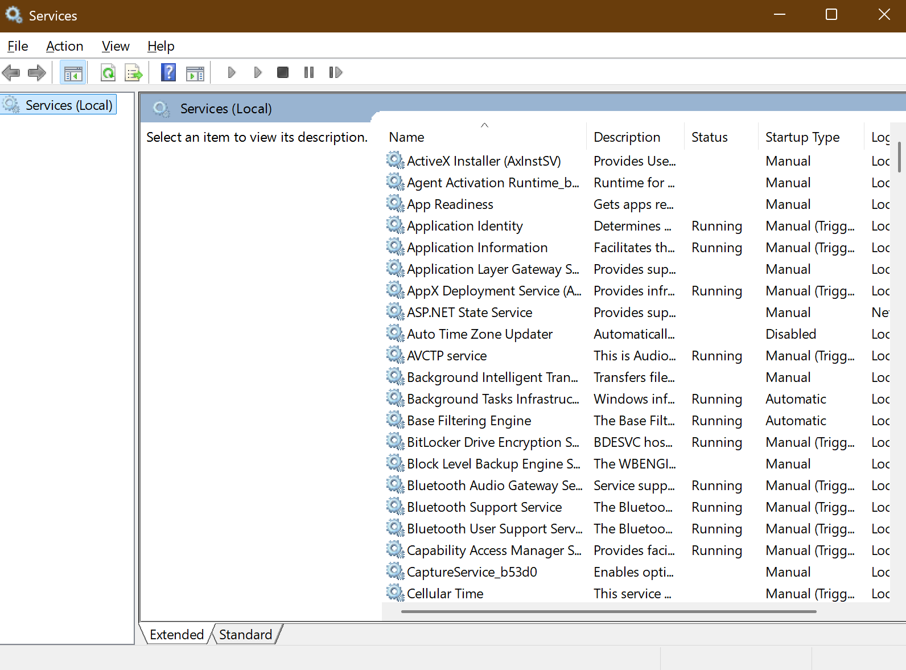

> services management tool

### 4.2.3. Task Scheduler

The **task scheduler** automates starting processes, batch files, or scripts at specified times.

- accessed via the **Task Scheduler** console or the Computer Management console.

  _In Linux, the cron utility is often used to run tasks or scripts at a particular time._

## 4.3. Memory & Disk Management

2 main types of storage components:

1. **System memory**: this type of memory is volatile, meaning that it is only preserved while the system is powered up. System memory is provided by Random Access Memory (RAM) modules.
2. **Mass storage**: to preserve data when the system is turned off, it is written as files to a mass storage device. Every PC comes with at least one such **fixed disk**. The fixed disk will either be a **hard disk (HDD)** or a **Solid-State Drive (SSD)**.

### 4.3.1. Memory Management

There is not a lot to configure in terms of memory management, as the operating system handles memory allocation automatically. However, it is essential to monitor and manage issues like **insufficient memory** or **memory leaks**.

**insufficient memory** may cause the system to crash or fail to start processes.

- adding more RAM or running fewer applications simultaneously are common solutions.

**memory leak** happens when memory addresses are continually claimed without being released, depleting resources.

- usually caused by badly written programs or malware

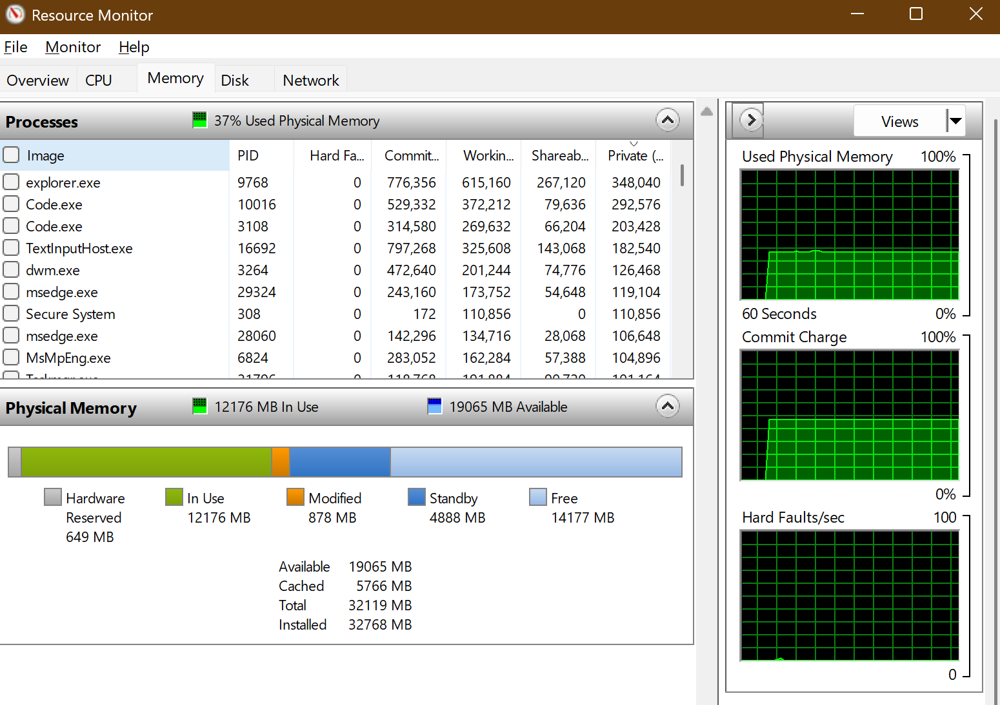

> use resource monitor to check system memory or to terminate offensive processes

### 4.3.2. Virtual Memory / Pagefile

The **pagefile** (**virtual memory**) is a reserved section of your storage drive that Windows uses as additional memory (RAM) when your system's physical memory is insufficient.

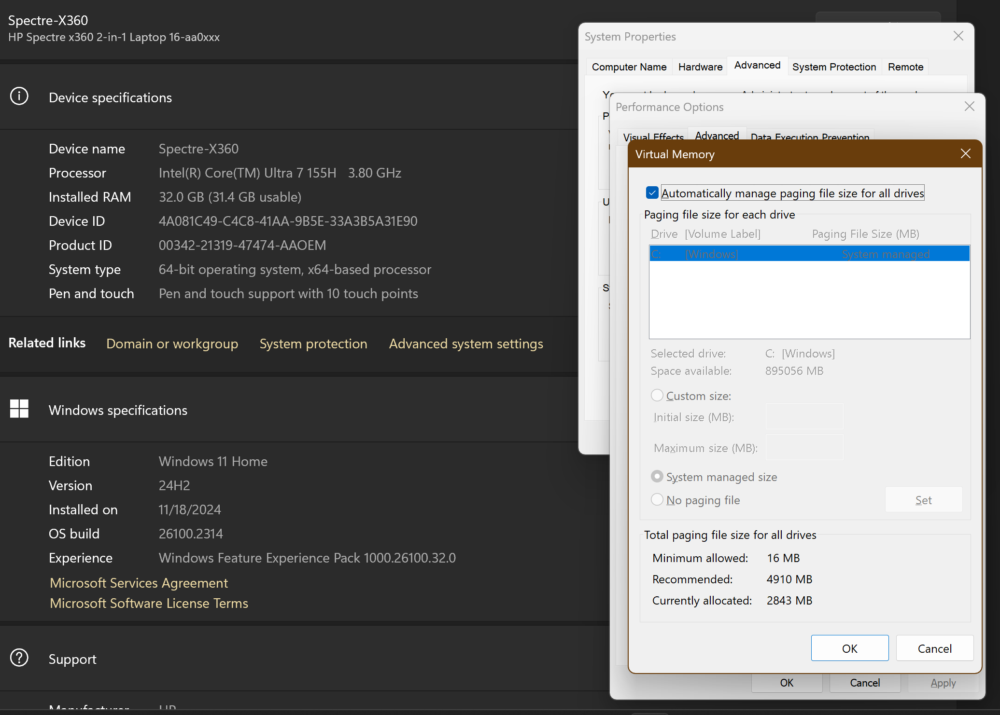

> Viewing pagefile settings via the advanced system settings.
>
> Windows has allocated 2.78GB of space to the pagefile.

( _traditional hard drives are much, much slower than system RAM and is often a performance bottleneck. Using an SSD as the main fixed disk will greatly improve performance_)

### 4.3.3. Disk Management

Windows provides a **GUI Disk Management tool** to format mass storage devices (disks and USB drives) and manage **partitions**.

**Partitions** allow a single disk to be divided into multiple different logical areas, each of which can be accessed via the OS as a separate **drive**.

- A disk must have at least one partition for the OS to use it.
- Each partition must be formatted with a **file system** so that the OS can read and write files to the drive.

[glossary: partition](../Glossary.md#partition)

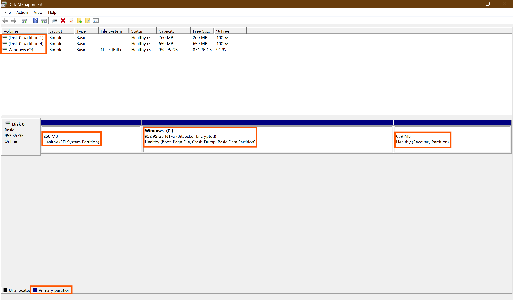

> disk management utility
>
> - Run: `diskmgr.msc`
> - CLI: `diskpart`

The Disk Management snap-in displays any fixed and removable drives attached to the system. The top pane lists drives; the bottom pane lists disks, showing information about the partitions created on each disk plus any unpartitioned space. You can use the tool to create and modify partitions, reformat a partition, assign a different drive letter, etc.

### 4.3.4. Command Line Interfaces

Most operating systems can be operated using a GUI controlled via a mouse, keyboard, and/or touchscreen, but a GUI is only one type of interface or shell.

A **Command Line Interface (CLI)** shell represents an alternative means of configuring an OS or application.

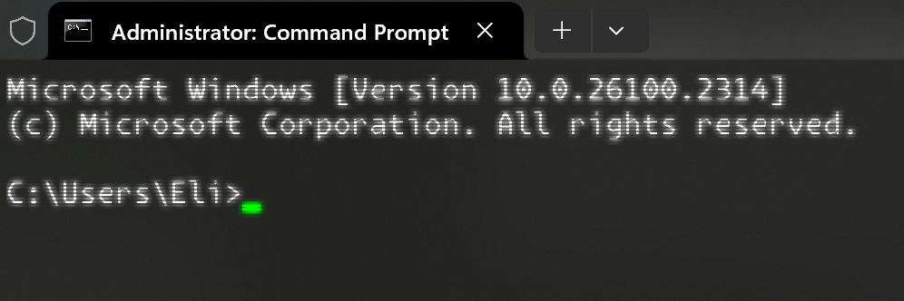

> Windows command prompt
>
> - Run: `cmd.exe`

There may be more than one CLI environment included with an operating system. For example, Windows provides both the **Windows Command Prompt (cmd.exe)** and **PowerShell** CLIs. Linux usually presents the **Bash (Bourne Again SHell)** but there are alternatives.

_The term "console" is often used interchangeably with "command line" or "command prompt" but has different technical meanings in Windows and UNIX/Linux._

## 4.4. Access control & Protection

**Access control** means that a computing device (or any information stored on the device) can only be used by an authorized person, such as its owner.

( _Access control on workstation operating systems is usually enforced by the concept of user accounts. Each user of the device is allocated an account and uses a password (or other credential) to authenticate to that account. The OS can restrict the privileges allocated to an account so that it is not able to reconfigure settings or access certain data areas._)

### 4.4.1. Administrator & Standard User Accounts

When the OS is first installed, the account created or used during setup is a powerful local **administrator account**. The account is assigned membership of the local Administrators group.

> You should only use this account to manage the computer (install applications and devices, perform troubleshooting, and so on).

( _You should create ordinary user accounts for day-to-day access to the computer. This is done by putting additional users of the computer in the Standard users group. Standard users cannot change the system configuration and are restricted to saving data files within their own user profile folder or the Public profile. For example, a user named David could only save files within C:\Users\David or C:\Users\Public. Administrators can access any folder on the computer._)

### 4.4.2. Least Privilege & User Account Control

The principle of **least privilege** is that users should have only sufficient permissions required to perform tasks and no more.

**User Account Control (UAC)** is Windows' solution to the problem of elevated privileges. In order to change important settings on the computer (such as installing drivers or software), administrative privileges are required. Early versions of Windows make dealing with typical administrative tasks as an ordinary user very difficult, meaning that most users were given administrative privileges as a matter of course.

> This makes the OS more usable, but it also makes it much more vulnerable, as any malicious software infecting the computer would run with the same administrative privileges.

**UAC** counters this by running accounts in a **protected sandbox**.

When users need to exercise administrative rights, they must explicitly confirm use of those rights by entering the administrator's credentials or by clicking through an authorization dialog. The desktop darkens into a special secure mode to prevent third-party software from imitating the authorization dialog.

( _Note that options in Control Panel and menus and dialogs with the icon on or next to them may require you to authorize use of the command through UAC._)

### 4.4.3. Creating Other User Accounts

Windows supports two types of user accounts:

1. **Local accounts**: these are defined on one computer only.
2. **Microsoft accounts**: these are connected to Microsoft's cloud services. A Microsoft account can be used to sign in on multiple devices and synchronize settings, apps, and data between them.

To create a new account:

- open **settings** then click **accounts**
- Select **family & other people**
- click **add** someone else to this PC.
- enter the user's email address for their Microsoft account
- click **next** and click **finish**.

The user must complete the process of signing in themselves.

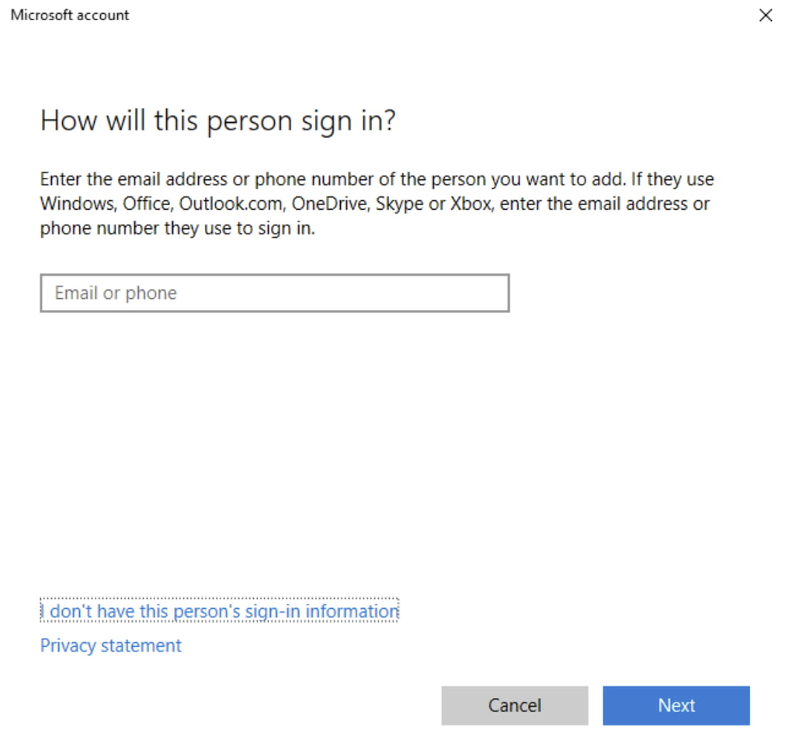

> creating a new account

_To create a local account, you would click the "**I don't have this person's sign-in information**" link._

### 4.4.4. Managing User Accounts

Users can manage their own account from settings:

- In the **accounts node**, they can select and configure options on the following tabs:

  - **Your info**—enables you to configure options such as a picture for your account
  - **Email & app accounts**—allows you to associate accounts with email and other apps on the local computer, such as a Microsoft Outlook or Gmail account.
  - **Sign-in options**—allows you to enable and configure advanced sign in options, such as Windows Hello (biometrics), Picture password, and PIN sign in.
  - **Access work or school**—from here, you can define additional accounts that you use to access other networks, such as:

    - a work account or an account used for accessing school resources

In professional/enterprise Windows editions, administrators can use the Local **Users and Groups** snap-in within the Computer Management console to configure accounts. Options include:

- setting a user’s password
- disabling/enabling an account
- unlocking an account after too many bad passwords
- configuring group membership
- specifying login scripts and profile paths
- Configuring local user accounts

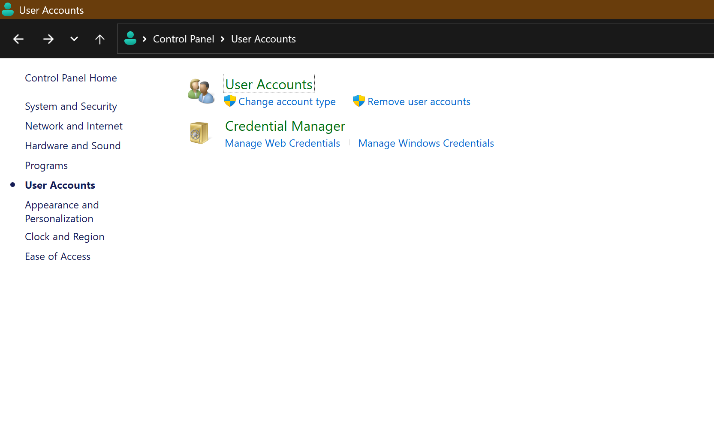

> configure user accounts from the control panel

_This describes managing accounts on a standalone computer. On a corporate network, such as a Windows domain, accounts, privileges, and permissions are managed on a centralized server rather than on each workstation._
Here’s a structured and formatted version for better legibility:
Here’s the fully detailed version with simplified sentences where possible, but nothing omitted:

# 5. Troubleshooting & Support

**Objectives**:

- Describe basic support and troubleshooting procedures.
- Use websites and tools to obtain support and search for advice and help.

## 5.1. Support & Troubleshooting

Effective troubleshooting requires understanding how a system is supposed to work and knowing common issues that arise. _With complex systems, you must rely on general troubleshooting skills rather than specific knowledge._

For example:

- **Cause**: A hard disk fault.
- **Symptom**: The computer displays a "blue screen."
- **Consequence**: The user cannot work.

  _From a business point-of-view, resolving the consequences of the problem is often more important than solving the original cause._

> Providing a replacement workstation while fixing the disk minimizes downtime.

## 5.2. CompTIA Troubleshooting Model

The CompTIA troubleshooting model is methodical and consists of the following steps:

\*\* \_(must know) \_\*\*

1. **Identify the problem**.

   - Gather information
   - duplicate the problem, if possible
   - question users.
   - Identify symptoms and determine if anything has changed.
     _Handle multiple problems individually to avoid confusion._

     > "Observation is key—often the issue lies in details users may overlook."

2. **Research knowledge bases or the Internet.**

3. **Establish a theory of probable cause.**

   - Question the obvious
   - Consider different approaches
   - Divide & conquer

4. **Test the theory to determine cause**

   - Confirm or reject the theory.
     _If the theory is not confirmed, iterate with a new theory or escalate._

5. **Establish a plan of action** to resolve the problem and identify potential side effects.

6. **Implement the solution** or escalate as necessary.

7. **Verify full system functionality** and, if applicable, implement preventive measures.

8. **Document findings / lessons learned, actions, and outcomes**

_(Balancing **efficiency** with **structure** is crucial in time-sensitive troubleshooting situations.)_

## 5.3. Identifying the Problem

Approach troubleshooting logically, beginning with **identifying the problem**,

### 5.3.1. Question Users & Determine Changes

Most information is obtained through questioning the user to classify the problem based on its nature and scope. (describe symptoms, current status, error messages, & unusual conditions)

Key questions include:

- **How many are affected?**

  _(Severity increases if the problem affects more users.)_

- **When did the problem start?**

  _(This helps pinpoint potential causes.)_

- **What has changed?**

  _(Changes often correlate with the root cause.)_

### 5.3.2. Duplicate the Problem and Identify Symptoms

Observe the issue firsthand if possible, via remote access or an in-person visit.

> "If the problem cannot be duplicated on a reference system, the issue may be specific to the user’s environment."

### 5.3.3. Approach Multiple Problems Individually

Separate distinct problems to tackle each one methodically.

> For instance, loss of Internet connectivity and lack of updates may be separate issues. Address each as a standalone case unless a connection is evident.

### 5.3.4. Gather Information & Research Symptoms

Use tools such as system logs, remote desktop, or user reports. _If the issue is unfamiliar, search knowledge bases or the Internet for similar symptoms._

> Document findings during this stage to aid collaboration or escalation.

## 5.4. Understanding the Problem

After gathering information, develop a theory of probable cause.

> "Understanding symptoms requires analyzing the situation logically to eliminate unlikely causes."

### 5.4.1. Question the Obvious

Always verify the basics.

> "Is the device powered on? Is it plugged in? Even simple mistakes can cause major confusion."

### 5.4.2. Divide & Conquer

Eliminate broad categories to focus the search. For example:

- _If a computer won’t connect to the network, test cables and sockets before delving into software issues._

> "Testing individual components narrows down the problem."

### 5.4.3. Consider Multiple Approaches

If one method fails, try another. Suggest workarounds when needed.

> "Workarounds address immediate concerns while the root cause is investigated."

### 5.4.4. Test the Theory and Escalate the Problem

Iteratively test and refine theories until the root cause is identified.

> "Escalate unresolved issues through appropriate support tiers based on complexity."

Tiered systems often escalate from basic troubleshooting to expert-level specialists.

## 5.5. Resolving & Documenting the Problem

With the root cause identified, plan and implement a resolution carefully.

### 5.5.1. Establish a Plan of Action

Determine whether to repair, replace, or ignore the issue.

> "Using a ‘known good’ duplicate cable or device can confirm whether the original is faulty."

### 5.5.2. Implement the Solution

Follow a detailed plan, testing after each step.

If changes are ineffective, reverse them to prevent further complications.

### 5.5.3. Verify Full System Functionality & Implement Preventive Measures

Validate that the solution resolves the issue and that the system operates normally. _Take steps to prevent recurrence._

> "If a mislabeled network jack caused confusion, label it clearly to avoid future issues."

### 5.5.4. Document Findings, Actions, & Outcomes

Record all relevant details to build a knowledge base for future use.

Complete and clear documentation aids in resolving similar issues and supports trend analysis

Ticketing systems help track responsibilities and problem statuses

## 5.6. Troubleshooting PC Issues

If troubleshooting a PC that won't start up, inspect components for physical damage or wear. During startup, listen for beeps and observe LEDs.

When you start a computer, it automatically runs a program stored in firmware called the **Power-On Self-Test (POST)**. The POST routine ensures that all components required to start the computer are present. If the tests complete successfully, the computer may issue a single beep. However, not all modern computers beep during startup. If no beep is heard, or if the computer boots silently, proceed with the following checks:

**No Beep**:

- check if the **power light** is active
- check if the **disk light** is flickering
- check if there is an **image on the screen**.

  _(You should also hear disk activity and the whir of fans inside the PC.)_

> If none of these are present the issue is likely power-related

- Verify the **power cable** and **fuse**.

  - If these are functional, the problem could lie in:

    - The computer's **internal power supply**.
    - The **electrical outlet** (test with another device, like a lamp).

> **Tip**: Solid green lights usually indicate functionality, while flashing or blinking LEDs may signal an issue. Refer to the device's manual for specifics.

**Multiple Beeps**:

- Beeping patterns specify problems and might be accompanied by error messages on the screen.
- **Check the keyboard**: Ensure no keys are pressed down, as this can cause errors.

**Screen Issues**:

- If the screen is dark:

  - Confirm the **monitor is plugged in** and switched on.
  - Verify the **power cable**, **fuse**, and **connection** between the monitor and computer.
  - If you see a "No Sync" message, the cable might be disconnected or damaged.
  - If the screen is dim, adjust the **brightness control**.

> "Modern POST routines minimize audible signals, so rely on LEDs and screen messages for additional diagnostics."

**Post-POST Boot Failures**:

If there are no POST issues, the firmware passes control to the operating system. If the OS fails to load:

- Look for **error messages** to diagnose the cause of the boot failure.

**Peripheral Device Failures**:

If the system boots but a peripheral device doesn't work:

- Check for **loose connections**.
- If physical issues are ruled out, update or replace the device's **driver**.

**Unexpected Crashes**:

For systems that crash unexpectedly:

- **Overheating** is a common cause. Ensure the computer isn't running too hot.
- **Inspect hardware and software** for potential faults.

> "Regular maintenance and proactive diagnostics help avoid recurring problems"

## 5.7. Getting Support

When troubleshooting a system, its important to not attempt solutions that may be beyond your experience.

You could easily cause more damage by "experimenting"

Follow the basic guidelines for troubleshooting specific problems in the manufacturers documentation. The setup or maintenance guide should be included with a new PC system, though often it is available as a PDF rather than a printed copy,

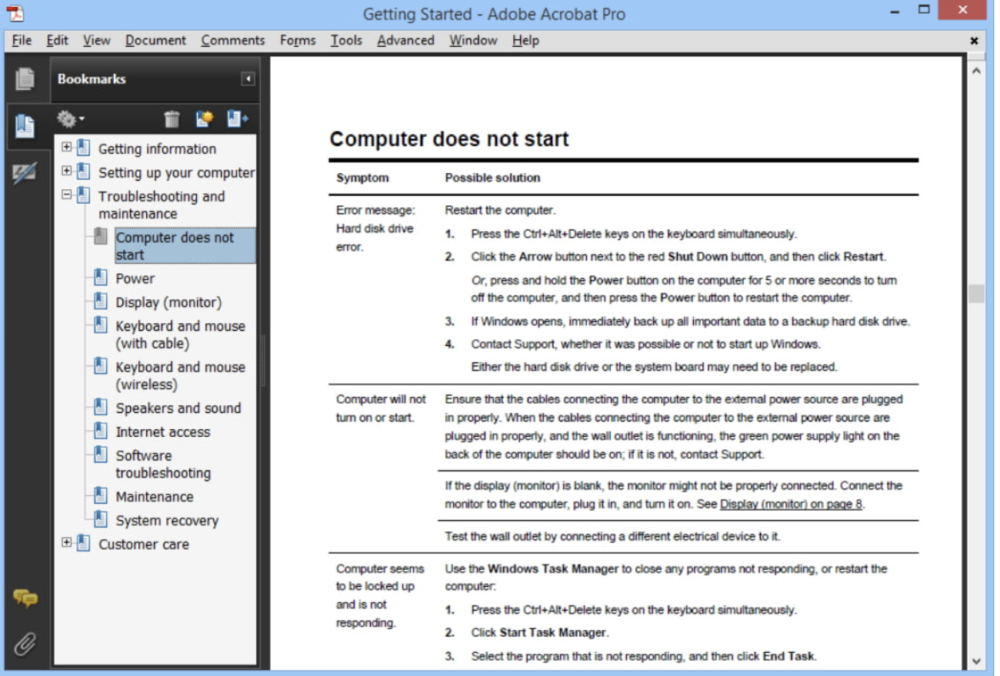

> The system's "Setup" or "Getting Started" guide will usually include troubleshooting advice.

You can also use the vendor's website to look for the documentation; typically, you will need to use the product code to find this.

For example, on HP's website, click the link for "Support" then choose the "Drivers and downloads" option. Enter the product name or code to view the available files. This will include drivers for hardware components and system guides and manuals.

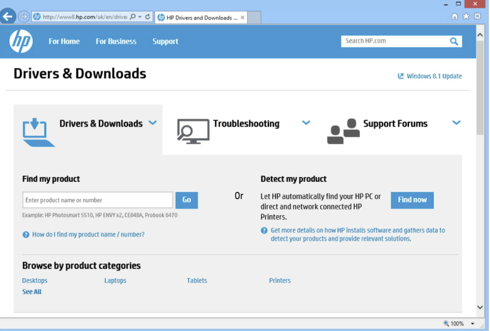

> Use a vendor support site to obtain the documentation, drivers, and advice.

### 5.7.1. Windows Help & Tips

If you have a software problem rather than a computer one, you can access online help for Windows you can also use the **Tips** app from start. (Windows 10)

### 5.7.2. Contacting Technical Support

If there is a problem with your **computer** or with a **software application**, it is likely that you will need help to fix it. You may be able to get help from your **business's help desk**, from the **computer manufacturer**, or from the **software vendor**. You may be able to access support services by phone, by email, or through a website.

> a lot of support is now done remotely.

Most IT support works on the basis of a **job ticket**.

When you contact a support operator, they will open the ticket and ask you to provide a description of the problem.

You should provide the following information:

- Your name and contact information.
- The software or device you are having trouble with (including its version number, which can usually be found through the Help > About command, or model and serial number).
- The date you purchased the system (if applicable).
- A description of the problem, including any error message or number.

> Be polite and calm when reporting problems. You may feel frustrated or be a bit fearful that you will lose important work, but if you are rude or cannot provide clear information it will just make the problem harder to resolve.

The operator should then work with you to try to resolve the problem. If the operator asks you to perform troubleshooting actions, listen carefully to the steps and confirm when you have completed each one. If the operator has to call you back, make sure you get their name and your job ticket number. When you agree that the problem has been solved, the ticket can be closed.

### 5.7.3. Technical Community Groups

When seeking support, prioritize **warranty support** if available. Alternatively, consider these steps:

1. **Posting Guidelines**:

   - Check FAQs before posting.
   - Avoid cross-posting the same issue across multiple forums.
   - Clearly describe the problem with relevant details.
   - Be patient when awaiting a response.

2. **Available Resources**:

   - Software vendors offer forums and support sites with:

     - Troubleshooting resources
     - Assisted support
     - Advanced documentation

## 5.8. Recommended Support Sites

[Microsoft Support](https://support.microsoft.com)

- Solution centers for each product.

[TechNet](https://technet.microsoft.com)

- Advanced articles and product documentation.

[Microsoft Answers](https://answers.microsoft.com/)

- Community site with newsgroups, blogs, webcasts, and forums dedicated to Microsoft products.

[MVPs.org](https://mvps.org)

- Links to useful sites maintained by Microsoft MVP volunteers.

> These forums are monitored by **Microsoft Most Valued Professional (MVP)** volunteers.

**Subscription-Based Tech Communities**:

- [Experts Exchange](https://experts-exchange.com)
- [Petri IT Knowledgebase](https://petri.com)
- [Tom's Hardware](https://tomshardware.com)

## 5.9. Using a Search Engine

A search engine usually works by compiling a database of information about web pages. This is often done automatically by software agents called **robots** or **spiders**

Users use keywords which match with the database. Some popular search engines include

[Google](https://google.com)

- The most widely used search engine, offering tailored versions for different countries (e.g., [Google UK](https://google.co.uk), [Google Australia](https://google.com.au)).

[Microsoft Bing](https://bing.com)

- A popular alternative with a wide range of features and localized versions.

[DuckDuckGo](https://duckduckgo.com)

- A privacy-focused search engine that does not track users.

[Yahoo Search](https://search.yahoo.com)

- Provides web search results and additional features like news and shopping.

[Baidu](https://www.baidu.com)

- A leading search engine in China, designed for the Chinese market.

[Yandex](https://yandex.com)

- A prominent search engine in Russia and surrounding regions.

> When searching do not use common words such as "and" or "the." Using more unusual words will help to limit the number of matches.

## 5.10. Search Selection Criteria

As you start to build more complex search phrases, you can use special syntax and search engine tools.

| **Syntax**  | **Usage**                                                                                           | **Example**          |
| ----------- | --------------------------------------------------------------------------------------------------- | -------------------- |
| `"`         | Use double quotation marks (") to specify a match to the exact phrase as you typed it.              | **"Monty Python"**   |
| `+`         | Put a plus sign (+) in front of a word that must be found in the documents exactly as you typed it. | **+snake +Python**   |
| `-`         | Put a minus sign (-) in front of a word to exclude it.                                              | **python -Monty**    |
| `OR` / `\|` | Find either of the words. The pipe (`\|` ) can also be used to mean the same thing.                 | **snake \| python**  |
| `*`         | The wildcard `*` represents unknown words between known ones.                                       | **genius \* python** |
| `Fields`    | Some engines may allow you to search for words within a particular field (e.g., URL or TITLE).      | **url:monty python** |

> As an alternative to using syntax, you can usually access the search engine's Advanced Search Page to specify criteria using a form.

**_Google's advanced search form_**

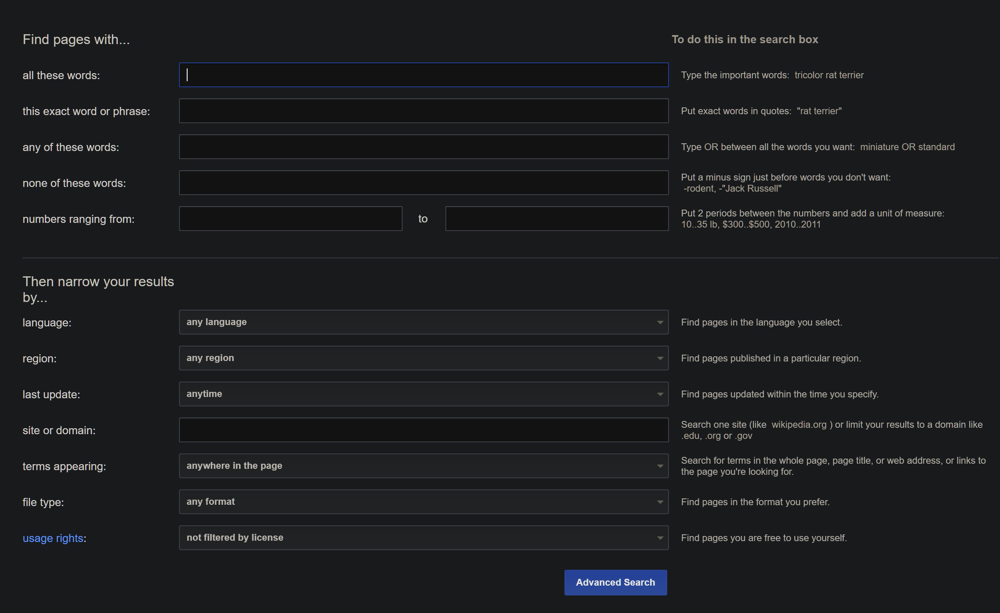

> [!NOTE] NOTE
> this syntax is not always supported by all search engines. Also, there may be additional requirements (for example in Google you have to enter an advanced query within square brackets).
