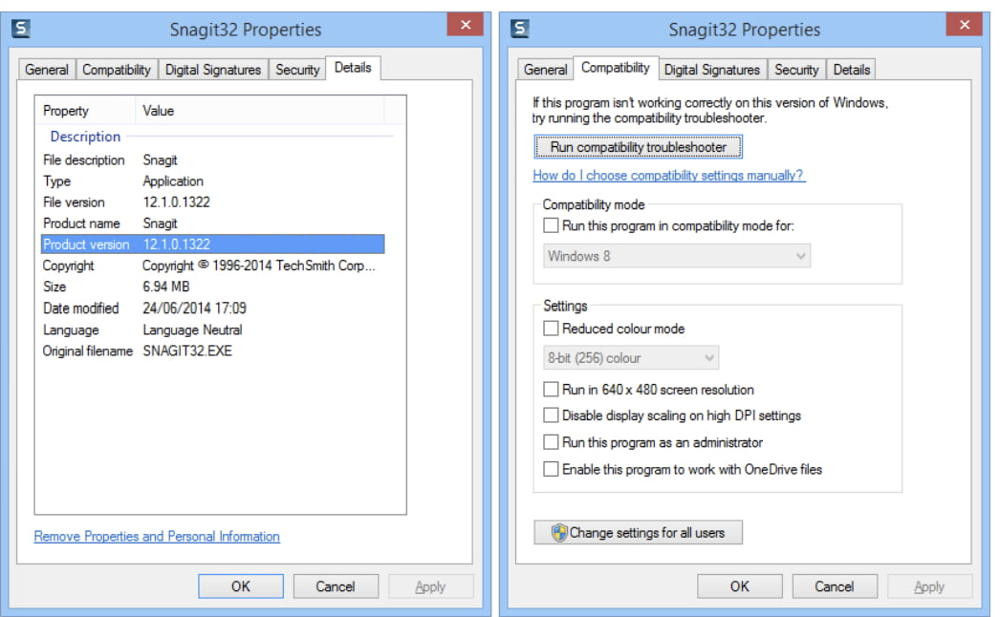
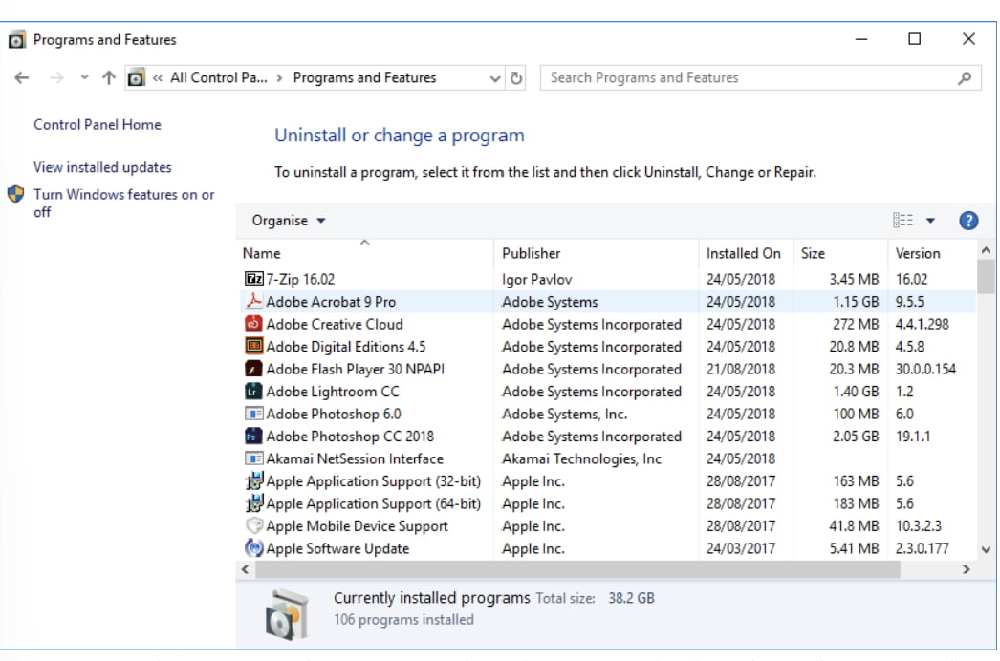
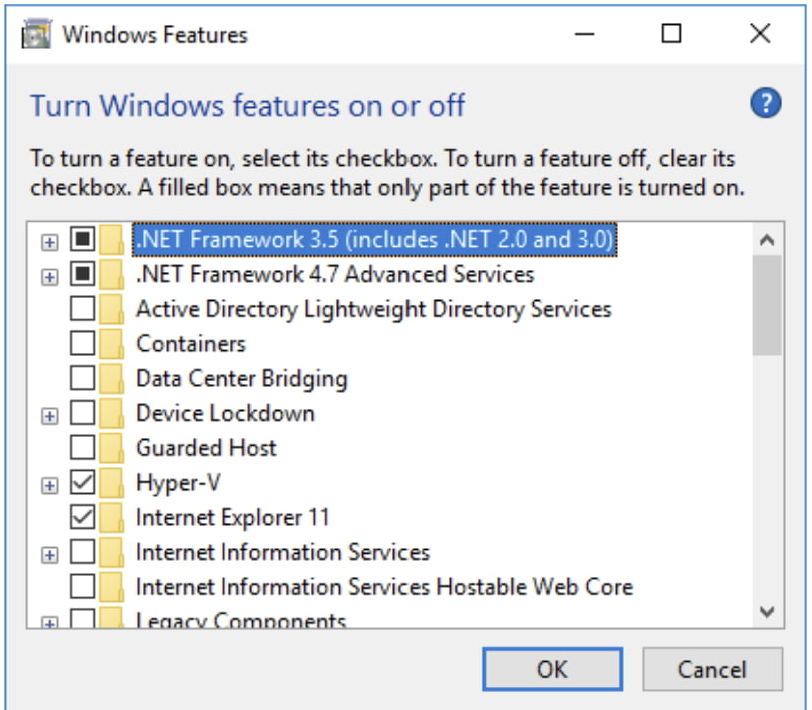
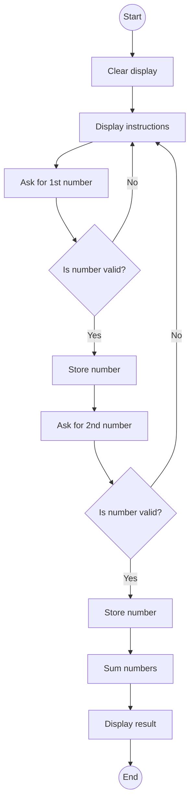
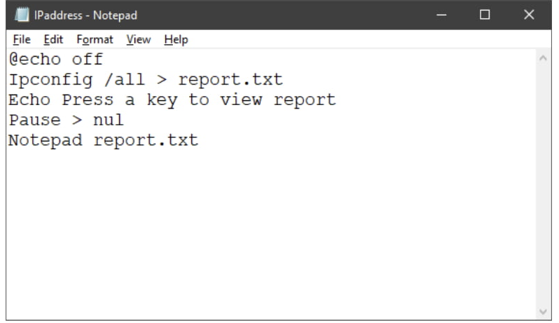
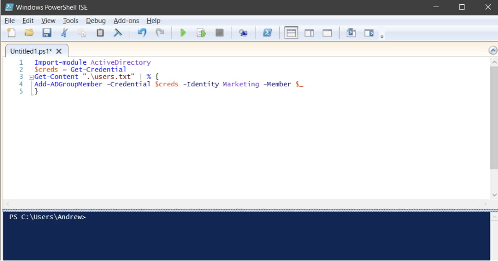
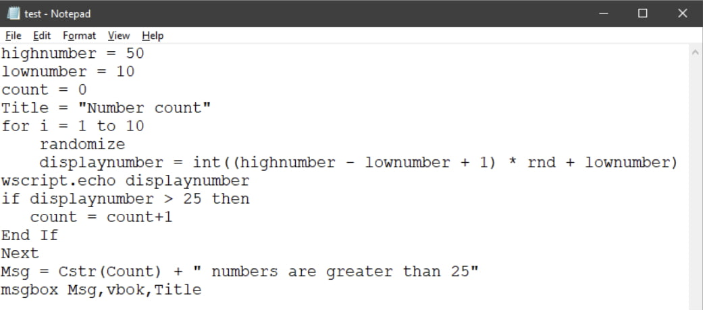
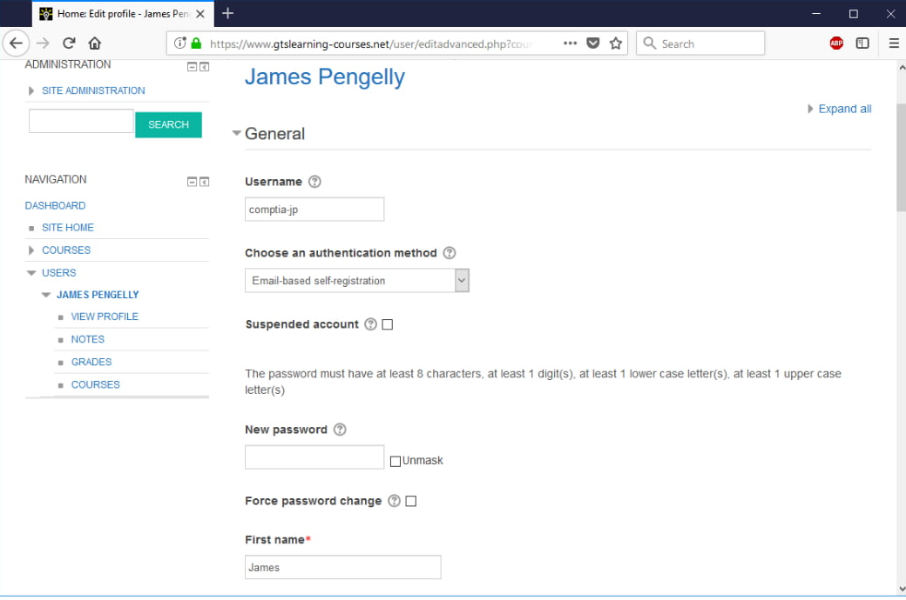
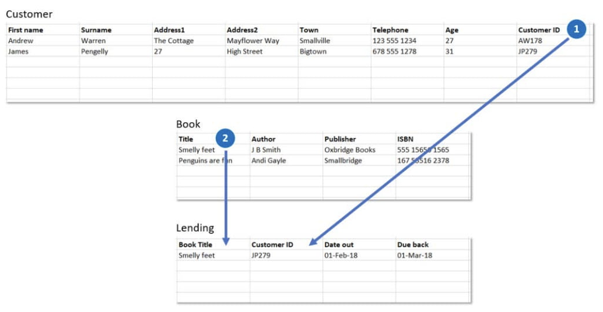

# Module 2: Using Apps and Databases <!-- omit in toc -->

- [1. Using Data Types \& Units](#1-using-data-types--units)
  - [1.1. Notational Systems](#11-notational-systems)
    - [1.1.1. Decimal Notation](#111-decimal-notation)
    - [1.1.2. Binary Notation](#112-binary-notation)
    - [1.1.3. Hexadecimal Notation](#113-hexadecimal-notation)
    - [1.1.4. Conversion](#114-conversion)
  - [1.2. Units of Measure](#12-units-of-measure)
    - [1.2.1. Bits and Bytes](#121-bits-and-bytes)
    - [1.2.2. Throughput Units](#122-throughput-units)
    - [1.2.3. Processing Speed Units](#123-processing-speed-units)
  - [1.3. Data Types](#13-data-types)
  - [1.4. Data Representation](#14-data-representation)
    - [1.4.1. ASCII Data Representation](#141-ascii-data-representation)
    - [1.4.2. Unicode](#142-unicode)
  - [1.5. The Value of Data](#15-the-value-of-data)
    - [1.5.1. Investing in Security](#151-investing-in-security)
    - [1.5.2. Security Controls](#152-security-controls)
  - [1.6. Intellectual Property](#16-intellectual-property)
    - [1.6.1. Copyright](#161-copyright)
    - [1.6.2. Trademarks](#162-trademarks)
    - [1.6.3. Patents](#163-patents)
    - [1.6.4. Digital Products](#164-digital-products)
  - [1.7. Data-Driven Business Decisions](#17-data-driven-business-decisions)
    - [1.7.1. Data Analytics (Relationship of Data to Information)](#171-data-analytics-relationship-of-data-to-information)
    - [1.7.2. Facilitating Data-Driven Business Decisions](#172-facilitating-data-driven-business-decisions)
- [2. Using Apps](#2-using-apps)
  - [2.1. Installing Applications](#21-installing-applications)
    - [2.1.1. Reading Instructions and Documentation](#211-reading-instructions-and-documentation)
    - [2.1.2. Installing a Desktop Application](#212-installing-a-desktop-application)
    - [2.1.3. Advanced Options](#213-advanced-options)
    - [2.1.4. Microsoft Store Apps](#214-microsoft-store-apps)
  - [2.2. Application Management](#22-application-management)
    - [2.2.1. Configuring Application Compatibility](#221-configuring-application-compatibility)
    - [2.2.2. Repairing and Uninstalling Software](#222-repairing-and-uninstalling-software)
    - [2.2.3. Enabling and Disabling Windows Features](#223-enabling-and-disabling-windows-features)
  - [2.3. Managing Software Licensing](#23-managing-software-licensing)
    - [2.3.1. Software Licensing and Agreements](#231-software-licensing-and-agreements)
    - [2.3.2. Registration](#232-registration)
    - [2.3.3. Subscription versus One-time Purchase](#233-subscription-versus-one-time-purchase)
    - [2.3.4. Shareware, Freeware and Open Source Applications](#234-shareware-freeware-and-open-source-applications)
  - [2.4. Productivity Software](#24-productivity-software)
    - [2.4.1. Web Browser Software](#241-web-browser-software)
    - [2.4.2. Spreadsheet Software](#242-spreadsheet-software)
    - [2.4.3. Word Processing Software](#243-word-processing-software)
    - [2.4.4. Presentation Software](#244-presentation-software)
    - [2.4.5. Visual Diagramming Software](#245-visual-diagramming-software)
  - [2.5. Collaboration Software](#25-collaboration-software)
    - [2.5.1. Email Software and Personal Information Managers](#251-email-software-and-personal-information-managers)
    - [2.5.2. Online Workspaces and Document Storage/Sharing](#252-online-workspaces-and-document-storagesharing)
    - [2.5.3. Remote Desktop and Screen Sharing Software](#253-remote-desktop-and-screen-sharing-software)
    - [2.5.4. Instant Messaging and VoIP Software](#254-instant-messaging-and-voip-software)
    - [2.5.5. Video Conferencing Software and Telepresence](#255-video-conferencing-software-and-telepresence)
  - [2.6. Business Software](#26-business-software)
    - [2.6.1. Desktop Publishing Software](#261-desktop-publishing-software)
    - [2.6.2. Graphic Design](#262-graphic-design)
    - [2.6.3. Computer Aided Design (CAD)](#263-computer-aided-design-cad)
    - [2.6.4. Project Management](#264-project-management)
    - [2.6.5. Accounting and Commercial](#265-accounting-and-commercial)
    - [2.6.6. Database Software](#266-database-software)
    - [2.6.7. Business-specific](#267-business-specific)
- [3. Programming and App Development](#3-programming-and-app-development)
  - [3.1. Programming Logic](#31-programming-logic)
    - [3.1.1. Program Sequence](#311-program-sequence)
    - [3.1.2. Using a Flow Chart](#312-using-a-flow-chart)
    - [3.1.3. Writing Pseudocode](#313-writing-pseudocode)
    - [3.1.4. Features of Programming Code](#314-features-of-programming-code)
  - [3.2. Programming Languages](#32-programming-languages)
    - [3.2.1. Compiled Languages](#321-compiled-languages)
    - [3.2.2. Interpreted Languages](#322-interpreted-languages)
    - [3.2.3. Query Languages](#323-query-languages)
    - [3.2.4. Assembly Language](#324-assembly-language)
    - [3.2.5. Markup Languages](#325-markup-languages)
  - [3.3. Programming Concepts](#33-programming-concepts)
    - [3.3.1. Identifiers](#331-identifiers)
    - [3.3.2. Containers](#332-containers)
    - [3.3.3. Branches](#333-branches)
    - [3.3.4. Loops](#334-loops)
    - [3.3.5. Operators](#335-operators)
    - [3.3.6. Procedures and Functions](#336-procedures-and-functions)
    - [3.3.7. Comments](#337-comments)
  - [3.4. Object-Oriented Programming](#34-object-oriented-programming)
  - [3.5. Scripting Languages](#35-scripting-languages)
    - [3.5.1. Batch Files](#351-batch-files)
    - [3.5.2. Windows Powershell](#352-windows-powershell)
    - [3.5.3. VBScript](#353-vbscript)
  - [3.6. Applications Platform and Delivery](#36-applications-platform-and-delivery)
    - [3.6.1. Single-Platform Delivery](#361-single-platform-delivery)
    - [3.6.2. Cross-Platform Delivery](#362-cross-platform-delivery)
    - [3.6.3. Application Delivery Methods](#363-application-delivery-methods)
- [4. Using Databases](#4-using-databases)
  - [4.1. Databases Concepts](#41-databases-concepts)
  - [4.2. Database Usage](#42-database-usage)
    - [4.2.1. Flat File Systems](#421-flat-file-systems)
    - [4.2.2. Database vs. Flat File Systems](#422-database-vs-flat-file-systems)
  - [4.3. Database Structure](#43-database-structure)
    - [4.3.1. Relational Databases](#431-relational-databases)
    - [4.3.2. Primary Key and Foreign Key](#432-primary-key-and-foreign-key)
    - [4.3.3. Relational Database Example](#433-relational-database-example)
    - [4.3.4. Constraints](#434-constraints)
    - [4.3.5. Semi-structured and Unstructured Databases](#435-semi-structured-and-unstructured-databases)
    - [4.3.6. 4.3.6 Document and Key/Value Pair Databases](#436-436-document-and-keyvalue-pair-databases)
  - [4.4. Relational Methods](#44-relational-methods)
    - [4.4.1. Data Definition Methods](#441-data-definition-methods)
    - [4.4.2. Data Manipulation Methods](#442-data-manipulation-methods)
    - [4.4.3. Permissions](#443-permissions)
  - [4.5. Database Access Methods](#45-database-access-methods)
    - [4.5.1. Direct/Manual Access](#451-directmanual-access)
    - [4.5.2. Query/Report Builder](#452-queryreport-builder)
    - [4.5.3. Programmatic Access](#453-programmatic-access)
    - [4.5.4. User Interface/Utility Access](#454-user-interfaceutility-access)
    - [4.5.5. Backups and Data Export](#455-backups-and-data-export)
  - [4.6. Application Architecture Models](#46-application-architecture-models)

### 0.0.1. Domain Objectives

| **Domain**                                   | **Objectives / Examples**                                                                                                                                                                                                                                                                                                                                                                                                                                                                                                                                                                                                                                                                                                                                                                                                                                                                                                                                                                                                                                                                                                                                                                                                                                                                                            |
| -------------------------------------------- | -------------------------------------------------------------------------------------------------------------------------------------------------------------------------------------------------------------------------------------------------------------------------------------------------------------------------------------------------------------------------------------------------------------------------------------------------------------------------------------------------------------------------------------------------------------------------------------------------------------------------------------------------------------------------------------------------------------------------------------------------------------------------------------------------------------------------------------------------------------------------------------------------------------------------------------------------------------------------------------------------------------------------------------------------------------------------------------------------------------------------------------------------------------------------------------------------------------------------------------------------------------------------------------------------------------------- |
| **Unit 1 / Using Data Types and Units**      | **1.1 Compare and contrast notational systems.**<br> • Binary <br> • Hexadecimal <br> • Decimal <br> • Data representation (ASCII, Unicode) <br><br> **1.2 Compare and contrast fundamental data types and their characteristics.** <br> • Char <br> • Strings <br> • Numbers (Integers, Floats) <br> • Boolean <br><br> **1.4 Explain the value of data and information.** <br> • Data and information as assets <br> • Importance of investing in security <br> • Relationship of data to creating information <br> • Intellectual property (Trademarks, Copyright, Patents) <br> • Digital products <br> • Data-driven business decisions (Data capture and collection, Data correlation, Meaningful reporting) <br><br> **1.5 Compare and contrast common units of measure.** <br> • Storage unit (Bit, Byte, KB, MB, GB, TB, PB) <br> • Throughput unit (bps, Kbps, Mbps, Gbps, Tbps) <br> • Processing speed (MHz, GHz)                                                                                                                                                                                                                                                                                                                                                                                        |
| **Unit 2 / Using Apps**                      | **3.1 Manage applications and software.** <br> • Application management <br><br> **3.3 Explain the purpose and proper use of software.** <br> • Productivity software (Word processing software, Spreadsheet software, Presentation software, Web browser, Visual diagramming software) <br> • Collaboration software (Email client, Conferencing software, Instant messaging software, Online workspace, Document sharing) <br> • Business software (Database software, Project management software, Business-specific applications, Accounting software) <br><br> **3.6 Compare and contrast general application concepts and uses.** <br> • Licensing (Single use, Group use/site license, Concurrent license, Open source vs. proprietary, Subscription vs. one-time purchase, Product keys and serial numbers) <br> • Software installation best practices (Reading instructions, Reading agreements, Advanced options)                                                                                                                                                                                                                                                                                                                                                                                         |
| **Unit 3 / Programming and App Development** | **3.4 Explain methods of application architecture and delivery models.** <br> • Application delivery methods—locally installed (Network not required, Application exists locally, Files saved locally) <br> • Application delivery methods—Local network hosted (Network required, Internet access not required) <br> • Application delivery methods—Cloud hosted (Internet access required, Service required, Files saved in the cloud) <br><br> **3.6 Compare and contrast general application concepts and uses.** <br> • Single-platform software <br> • Cross-platform software (Compatibility concerns) <br><br> **4.1 Compare and contrast programming language categories.** <br> • Interpreted (Scripting languages, Scripted languages, Markup languages) <br> • Compiled programming languages <br> • Query languages <br> • Assembly language <br><br> **4.2 Given a scenario, use programming organizational techniques and interpret logic.** <br> • Organizational techniques (Pseudocode concepts, Flow chart concepts, Sequence) <br> • Logic components (Branching, Looping) <br><br> **4.3 Explain the purpose and use of programming concepts.** <br> • Identifiers (Variables, Constants) <br> • Containers (Arrays, Vectors) <br> • Functions <br> • Objects (Properties, Attributes, Methods) |
| **Unit 4 / Using Databases**                 | **3.4 Explain methods of application architecture and delivery models.** <br> • Application architecture models (One tier, Two tier, Three tier, n-tier) <br><br> **5.1 Explain database concepts and the purpose of a database.** <br> • Usage of database (Create, Import/input, Query, Reports) <br> • Flat file vs. database (Multiple concurrent users, Scalability, Speed, Variety of data) <br> • Records <br> • Storage (Data persistence) <br><br> **5.2 Compare and contrast various database structures.** <br> • Structured vs. semi-structured vs. non-structured <br> • Relational databases (Schema, Tables, Rows/records, Fields/columns, Primary key, Foreign key, Constraints) <br> • Non-relational databases (Key/value databases, Document databases) <br><br> **5.3 Summarize methods used to interface with databases.** <br> • Relational methods (Data manipulation \[Select, Insert, Delete, Update], Data definition \[Create, Alter, Drop, Permissions]) <br> • Database access methods (Direct/manual access, Programmatic access, User interface/utility access, Query/report builders) <br> • Export/import (Database dump, Backup)                                                                                                                                                   |

# 1. Using Data Types & Units

On completion of this unit, you will be able to:

- Recognize and use different notational systems, data types, and units of measure.
- Compare and contrast fundamental data types and their characteristics.
- Discuss the importance of data and ways that a company can use it to make business decisions.

## 1.1. Notational Systems

A **notational system** is used to represent different quantities or characters.\
Common notational systems include:

- Decimal
- Binary
- Hexadecimal

### 1.1.1. Decimal Notation

The **decimal system** _(base 10)_ uses digits 0 to 9. Numbers greater than 9 require additional digits.\
For example, `12` in decimal means:

`1*10 +  2*1 = 12`

| Place Value   |    1000 |    100 |    10 |    1 |
| ------------- | ------: | -----: | ----: | ---: |
| Decimal Digit |       0 |      0 |     1 |    2 |
| Calculation   | 0\*1000 | 0\*100 | 1\*10 | 2\*1 |
| Result        |       0 |      0 |    10 |    2 |

> 0 + 0 + 10 + 2 = 12
>
> Each digit represents 10 times more than the previous digit, moving from right to left

### 1.1.2. Binary Notation

The **binary system** _(base 2)_ uses only 0 and 1. Each digit represents a power of 2.\
For example, `00110011` in binary equals `51` in decimal:

| Place Value  |    128 |    64 |    32 |    16 |    8 |    4 |    2 |    1 |
| ------------ | -----: | ----: | ----: | ----: | ---: | ---: | ---: | ---: |
| Binary Digit |      0 |     0 |     1 |     1 |    0 |    0 |    1 |    1 |
| Calculation  | 0\*128 | 0\*64 | 1\*32 | 1\*16 | 0\*8 | 0\*4 | 1\*2 | 1\*1 |
| Result       |      0 |     0 |    32 |    16 |    0 |    0 |    2 |    1 |

> 32 + 16 + 2 + 1 = 51
>
> Each digit represents a power of two, increasing from right to left

### 1.1.3. Hexadecimal Notation

The **hexadecimal system** _(base 16)_ uses digits 0 to 9 and letters A to F to represent numbers up to 15. Each digit represents a power of 16.\
For example, `1234` in decimal is `4D2` in hexadecimal:

| Place Value |    4096 |    256 |     16 |    1 |
| ----------- | ------: | -----: | -----: | ---: |
| Hex Digit   |       0 |      4 |      D |    2 |
| Calculation | 0\*4096 | 4\*256 | 13\*16 | 2\*1 |
| Result      |       0 |   1024 |    208 |    2 |

> 0 + 1024 + 208 + 2 = 1234
>
> Hexadecimal is widely used in programming and IP networks, e.g., IPv6

### 1.1.4. Conversion

Conversion between these notations can be done using a programming calculator. For instance, the Windows Calculator app in Programmer mode facilitates conversions.

## 1.2. Units of Measure

Computer storage and data transfer technologies are measured in units such as bits and bytes.

### 1.2.1. Bits and Bytes

A **bit** can represent `0` or `1`\
A **byte** is 8 bits.

Larger units:

- **Kilobyte (KB):** 1000 bytes `(10³)`

  - Small files are often measured in KB.

- **Megabyte (MB):** 1,000,000 bytes `10⁶`

  - Commonly used for files.

- **Gigabyte (GB):** 1,000,000,000 bytes `10⁹`

  - Used to describe disk capacity.

- **Terabyte (TB):** 1,000,000,000,000 bytes `10¹²`

  - Describes large storage systems.

- **Petabyte (PB):** 1,000,000,000,000,000 bytes `10¹⁵`
  - Used for large-scale storage networks / cloud systems

**_Binary Multiples (Base 2)_**

- **Kibibyte (KiB):** 1024 bytes `2¹⁰`

- **Mebibyte (MiB):** 1,048,576 bytes `1024²`

- **Gibibyte (GiB):** 1,073,741,824 bytes `1024³`

**_Practical Usage_**

- **Windows OS** uses binary measurements for file sizes and memory

  - `2 GB = 2048 MB`

- **Storage Vendors** use decimal measurements

  - `a 300 GB disk = 286 GiB`

- **Other Systems** like Ubuntu Linux and macOS use decimal notation for storage and file sizes.

### 1.2.2. Throughput Units

When data is transferred between components in a computer or over a network, the **throughput rate** is measured in **bits per second (bps)**.\
Throughput is expressed using multiples for easier readability:

- **Kbps _(Kb/s)_**: 1 thousand bits per second.

  > Older computer peripheral interfaces (or buses) and slow network links are measured in Kbps.

- **Mbps _(Mb/s)_**: 1 million bits per second.

  > Internal computer interfaces, wireless networks, and residential Internet links often have this throughput.

- **Gbps _(Gb/s)_**: 1 billion bits per second.

  > Found in modern PC bus standards and advanced network systems.

- **Tbps _(Tb/s)_**: 1 trillion bits per second.
  > Typical in major telecommunications links between data centers, cities, and countries.

Throughput units are always **base 10**.\
Transfer rates can also be expressed as **Bytes per second**, using a capital "B"

- KBps
- MBps
- GBps
- TBps

> Throughput describes how much data is transferred over a link, not how fast operations occur.

### 1.2.3. Processing Speed Units

The **speed** at which a computer works is measured in **Hertz** _(Hz)_, which represents cycles per second.\
This unit describes a computer’s internal clock or processor speed:

- **Megahertz _(MHz)_**: 1 million cycles per second.

  > Found in older PC bus interfaces and many network interfaces.

- **Gigahertz _(GHz)_**: 1 billion cycles per second.
  > Common in modern CPUs, buses, and fiber optic network equipment.

**Throughput** is not always equivalent to **signaling rate**.\
For example, system memory and network technologies can transmit multiple bits per cycle.

> Processing speed measures operational cycles, independent of data size or transfer rate.

## 1.3. Data Types

Computers _process_ data as **ones and zeros**, but software relies on **data types** to determine what operations can be performed. Data types are critical in **programming** and **database management**.

```js
console.log;
```

**_Number Data Types_**

- **Integers**: Whole numbers (e.g., `5`, `21`, `65536`).

  > Consume 1 to 8 bytes of storage.

- **Floating-point numbers (floats)**: Numbers with decimal points (e.g., `4.1`, `26.4`, `5.62`).

  > Consume 4 to 8 bytes of storage. Floats can also store whole numbers (e.g., `4.0`).

- **Boolean values**: Indicate **TRUE** or **FALSE** (`1` or `0`).

  > Consume a single bit of storage.

**_Textual Data Types_**

- **Characters**: Single textual characters, including letters, symbols, or numerical characters

  > Consume one byte of storage. Numbers entered as chars cannot be used in mathematical operations.

- **Strings**: Collections of text characters

  > There is no strict limit on storage, but the string length is typically defined during data type declaration.

To include special characters within strings, use an **escape character** (e.g., `"John said \'Hello World\' and left."`).

> Data types define how a computer interprets and manipulates stored information

## 1.4. Data Representation

When **binary values** are used for **char** and **string** data types, a method of **data representation** is necessary to map byte values to letters, numbers, and symbols in a character set.\
Two common ways of presenting character set data are **ASCII** and **Unicode**.

### 1.4.1. ASCII Data Representation

**ASCII _(American Standard Code for Information Interchange)_** represents each character or number in a text file or string variable as a **seven-bit binary number**, allowing **128 different values** (0 - 127).

Here are some examples from the **ASCII table**:

| Binary   | Dec | Character |
| :------- | :-- | :-------- |
| 010 0000 | 32  | Space     |
| 010 0001 | 33  | !         |
| 010 0010 | 34  | "         |
| 011 0000 | 48  | 0         |
| 011 0001 | 49  | 1         |
| 011 0010 | 50  | 2         |
| 100 0000 | 64  | @         |
| 100 0001 | 65  | A         |
| 100 0010 | 66  | B         |

> ASCII was created in **1963** when using 7 bits instead of 8 saved costs. Modern systems use **byte-based storage _(8 bits)_**, leading to **extended ASCII** for encoding 256 values.

### 1.4.2. Unicode

**Unicode** provides a standardized way to handle character data across platforms. It replaces ASCII as the dominant method of encoding character sets.

Unicode includes:

- **Code charts** for visual reference.
- **Encoding methods** such as **UTF-8**, **UTF-16**, and **UTF-32**.
- **Character properties** and rules for **normalization**, **rendering**, and **display** order (e.g., right-to-left languages).

> **UTF-8** is widely used by websites due to its efficiency and compatibility.

## 1.5. The Value of Data

Data represents more than encoded numbers and letters—it is a valuable **asset** for organizations and individuals. Protecting data is critical to prevent **financial loss** and ensure its availability.

### 1.5.1. Investing in Security

**Security controls** protect information systems by **preventing**, **deterring**, **detecting**, or **recovering** from unauthorized access or modifications.

- **Return on Security Investment (ROSI)** justifies security expenses by assessing the potential **cost of data loss** and **likelihood of breaches**.
- **Data exfiltration** occurs when attackers remove data without authorization.
- **Data breach** happens when private data is exposed publicly, whether stolen or not.

> Security investments reduce the impact and likelihood of data loss.

### 1.5.2. Security Controls

Examples of **security controls** include:

- **Backup**: Maintain copies of data for quick recovery.

- **Access Control**: Restrict access using:

  - **Permissions**: Assign file access rights to users and groups.
  - **Usage Restrictions**: Rights management software limits actions like copying or printing files.
  - **Data Encryption**: Encode data to make it unreadable without the key. Encryption applies to:

    - **Data at rest** (stored on a disk).

    - **Data in transit** (moving over a network).

  > Encryption ensures security even if data is transferred to another system.

- **Firewalls**: Control how network hosts and applications interact.

- **High Availability**: Use fault-tolerant technologies to ensure data access despite failures.

> Organizations must implement security controls to avoid financial losses.

## 1.6. Intellectual Property

**Intellectual Property (IP)** is often an organization’s most valuable asset. Protecting IP is crucial to prevent theft and ensure competitive advantage.

### 1.6.1. Copyright

**Copyright** is an **automatic legal protection** for original works such as books, software, and artwork. It grants the owner exclusive rights to **publish**, **distribute**, and **sell** the work.

Key points about copyright:

- Does not apply to **ideas**, **names**, or **titles**.
- Lasts for **15–70 years** after the creator's death, depending on the type of work.
- Copyright can be **transferred** (e.g., to employers or buyers).

> Example: Downloading a copyrighted song without permission violates the law, even if no copyright symbol is displayed.

### 1.6.2. Trademarks

**Trademarks** distinguish a company’s goods or services.

- **™**: Indicates a common-law trademark.
- **®**: Represents a **registered trademark**.

Using an existing trademark without authorization can result in legal action.

### 1.6.3. Patents

**Patents** protect inventions, including original ideas, provided they are:

- **Novel**: Not previously known.
- **Useful**: Serve a practical purpose.
- **Non-trivial**: Innovative and distinct.

Patents must be registered and are valid for a limited time. **Infringement** occurs when someone uses or sells a patented invention without permission.

### 1.6.4. Digital Products

**Digital products** (e.g., software, ebooks, music) are sold as **binary data** and have low manufacturing costs. However, they are prone to theft and unauthorized copying.

**Digital Rights Management (DRM)** enforces pay-per-use restrictions and limits usage to authorized devices.

> IP protection ensures that organizations retain control and value over their creations.

## 1.7. Data-Driven Business Decisions

Data and information are essential for driving **business decisions** and **strategies**. They help companies become more efficient, improve customer satisfaction, and develop better products and services.

- **Production and Fulfillment**:

  - Analyzing process flows, manufacturing, assembly, delivery, transportation, and ordering systems:
    - **Benefits**: Improves productivity, reduces costs, and enhances customer satisfaction.

- **Sales and Marketing**:
  - Data from web searches and social media:
    - **Benefits**: Enables **personalized advertising**, identifies trends, and helps create products to meet changing demands.

### 1.7.1. Data Analytics (Relationship of Data to Information)

**Data analytics** transforms raw data into meaningful insights to inform business decisions. The process includes:

- **Data**:

  - Raw values collected by a system (e.g., logs from web servers, including time of visits, visitor locations, browser types, time spent on pages, and clicked links).

- **Information**:

  - Summarized data points (e.g., analyzing web logs to determine the number of **unique visitors**, excluding repeat visits).

- **Insights**:
  - Meaningful conclusions (e.g., using insights from web page analytics to increase unique visitor numbers).

> Analytics transforms data into information, which leads to actionable insights.

### 1.7.2. Facilitating Data-Driven Business Decisions

To support **data-driven decision-making**, systems must enable data **processing**, **analyzing**, and **reporting**. Key components include:

- **Data Capture and Collection**:

  - Data sources include **web server logs** and **Internet of Things (IoT)** sensors.
  - Storage solutions:
    - **Relational Databases**: Traditional method for structured data.
    - **Semi-structured Data Warehouses**: Suitable for large-scale or less structured data.

- **Data Correlation**:

  - Software identifies patterns and relationships in data sets (e.g., discovering that blue color schemes attract more visitors than yellow).
  - Tools like **AI and Machine Learning**:
    - Automate and enhance correlation.
    - Reduce the need for human intervention.

- **Meaningful Reporting**:
  - Analytics systems present insights visually (e.g., **charts**, **graphs**, and **query tools**).
  - **Security Measures**:
    - Ensure data and reports are accessible only to authorized users.

> Efficient systems for data capture, correlation, and reporting are critical for informed business decisions.

# 2. Using Apps

On completion of this unit, you should be able to:

- Install and uninstall software applications and configure compatibility settings.
- Explain the importance of software licensing and the types of licenses available.
- Describe the key features of different types of applications and associated file formats.

## 2.1. Installing Applications

Application Installation Requirements:

- verifying compatibility with your operating system
- ensuring your hardware meets system requirements
- using proper setup programs.

This section also explains User Account Control (UAC) security features and explores default and custom installation options for both desktop and Microsoft Store apps.

### 2.1.1. Reading Instructions and Documentation

Always follow software installation best practices:

- Ensure the software is compatible with your **Operating System (OS)**.
- Make sure your **hardware** meets the application's recommended system requirements.
- Review any special installation instructions or known issues.
- Confirm that you have a valid **agreement** or **license** to install and use the product.

### 2.1.2. Installing a Desktop Application

Windows creates folders for storing system and application files, such as **"Windows"** and **"Program Files"**. The contents of these folders should not be changed manually, and access is usually restricted to the **administrator**.

Applications should be installed using the supplied setup program. To install a program, the user must be an administrator. The setup files are usually provided on a setup disc or downloaded from the internet.

- Insert the program disc into the drive and select the option to install the software.
- Alternatively, download the setup program from a website, locate it, and open it through Explorer.

To ensure a successful install, close all other programs and disable **anti-virus software** (choose where to get your apps from).

When installing, you'll encounter **Windows' User Account Control (UAC)** security feature. UAC checks whether the program has a **digital certificate**, ensuring it is created by a trustworthy software publisher.

> Invalid or Missing Digital Certificate Warning Message
>
> UAC verifies if the program has a valid digital certificate.

The setup program will then provide a wizard for choosing program components, selecting the install location (always choose "Program Files" unless you have a good reason not to), and creating shortcuts.

### 2.1.3. Advanced Options

Most software installer packages offer a choice between **default** and **custom installation**.

- **Custom Installation** allows you to choose specific settings, such as the install location, icons, or startup/autorun options.
- A custom installation may also involve the selection of specific **feature sets** or **modules** within the software package.

### 2.1.4. Microsoft Store Apps

In recent Windows versions, you can install two types of software:

1. **Desktop Applications**: Installed and managed using Programs and Features, as described earlier.
2. **Apps**: Installed and managed via the _Microsoft Store_.

Unlike desktop applications, **store apps** run in a restrictive _sandbox_. This sandbox is designed to:

- Prevent the app from making system-wide changes.
- Prevent a faulty app from crashing the entire OS or interfering with other apps.

This extra level of protection allows users with **standard permissions** to install store apps. Installing a store app doesn't require UAC confirmation or admin privileges.

## 2.2. Application Management

Application Management focuses on configuring, maintaining, and troubleshooting software to ensure optimal performance. This includes adjusting compatibility settings, repairing or uninstalling malfunctioning programs, and enabling or disabling system features as needed. Effective management helps enhance system stability and user productivity.

### 2.2.1. Configuring Application Compatibility

If you're having trouble running an application, inspect the **Details** tab for troubleshooting. This tab will inform you whether you're running the latest version with the most recent patches.

The **Compatibility** tab can be used to run the program in a compatibility mode (e.g., for **Windows 98**) and adjust display settings.

Windows includes features such as User Account Control (UAC) to enhance system security, particularly by protecting critical directories like the system root and Program Files. Issues with non-functioning software can often be resolved by uninstalling and reinstalling the application. Running a program as an administrator can also solve certain problems.

Additionally, you can disable advanced desktop compositing effects to address specific compatibility issues. (e.g., transparency, animations, shadowing, Window management effects)



> use the details tab in a programs properties dialog to find the version number & the compatibility tab to configure settings for legacy applications.
>
> Tip: you need a user to tell you the version number, it is usually listed in "About" menu option in the app/software possibly in the "Help" section

### 2.2.2. Repairing and Uninstalling Software

The best solution to fix software that stops working is usually to uninstall then reinstall.

Some programs may also support a **repair** option (quicker & preserve settings)

Some programs may have optional components, which you can add/remove using the **change** option

You will also want to uninstall unneeded programs and trial versions (bloatware)

To use any of these options, open **Programs & Features** in **Control Panel** click on the program icon, then choose the appropriate option

In order to uninstall a program successfully, you should close any applications / files that might lock files installed by the application or the PC will need to be restarted.

You might also need to disable anti-virus software (although not Windows Defender). If the uninstall program cannot remove locked files, it will normally prompt you to check its log file for details. These files & directories can then be deleted manually.

If uninstalling and reinstalling does not work , you may need to perform a **clean uninstall** (e.g., removing files & settings manually, following the instructions on the vendor's website)



> select a program then choose an option from the toolbar.

If you click _view installed updates_, the list will display patches or hotfixes installed for Windows. You can use the Wizard to uninstall a patch.

### 2.2.3. Enabling and Disabling Windows Features

Windows comes with a number of components & add-ons that may be enabled or disabled by default. You can control these by clicking the **turn Windows features on** link in Programs & Features.



> Turning Windows features on or off

## 2.3. Managing Software Licensing

Check that the software is properly licensed for use when installing an app.

### 2.3.1. Software Licensing and Agreements

When you buy software, you must read and accept the license governing its use, often called the **End User License Agreement (EULA)**.

Usually, the software is activated using a **product key**. The product key generates **product ID** or **serial number**, often used to obtain technical support.

> The Product ID is typically displayed when the application starts and can be accessed via the About option on the Help menu.

**Single Use License**: Permits installation of software on one computer only.

For companies with many employees needing the same software:

- **Group use/site license**: Allows installation on an agreed number of computers for unlimited employee use simultaneously.
- **Concurrent license**: Limits the number of users who can access the software at one time. Companies must monitor usage to ensure compliance with the permitted number of host-installs or concurrent users.

When a site has a large number of networked computers, licensed software can be installed onto a **network server**.

- **Client Access Licenses (CALs)**: Licenses permitting users to access software hosted on a network server.

> This setup allows all authorized users to access the software without individual installations.

It is illegal to use or distribute unauthorized copies of software (pirated copies).

> Pirated software often contains errors and viruses.

Another critical part of a software agreement involves how any data gathered and processed by the software is used, stored, and retained by the software vendor.

> Properly adhering to licensing agreements ensures legal compliance, avoids penalties, and protects users from potential security risks associated with pirated software.

### 2.3.2. Registration

Registration will be prompted upon app setup, either using an online form or card supplied with the setup disc.

> Registration is usually optional unless required to receive support / updates and validate warranty

### 2.3.3. Subscription versus One-time Purchase

Historically, software licensing tended toward **one-time purchases** of licenses for a given number of devices / users seats.

> The one-time purchase price would give perpetual use of the software, though subsequent upgrades would normally involve a new license fee.

This model is being replaced by **subscription-based licensing**.

> Organizations pay a per-user monthly fee to get access to the software. In this model, upgrades are provided as part of the subscription. (microsoft Office 365)

### 2.3.4. Shareware, Freeware and Open Source Applications

Not all software is distributed via the commercial licensing / subscription models described above.

Shareware, freeware, and open source licenses represent different ways of making applications available.

- **Shareware**: free software available to evaluate for a limited period. [Shareware](https://en.wikipedia.org/wiki/Shareware)

  - You must register / pay fee to continue using after limited period
    > Registration often comes with extra features / support.

- **Freeware**: software free of charge (X-Mouse). [Freeware](https://en.wikipedia.org/wiki/Freeware)

  > With shareware or freeware, the copyright is still held by the publisher. Both may be governed by a license, which may restrict its use (sharing / redistributing / selling).

- **Open source**: software that also makes the **program code** used to design it available.

  > Other programmers can contribute.
  > Allows commercial use of applications derived from the original but likely to impose same conditions on further redistributing.

## 2.4. Productivity Software

Productivity software includes applications for creating documents, managing data, and delivering presentations.

**Key Features:**

- **Common Use Cases**:

  - Writing reports or letters.
  - Creating presentations.
  - Analyzing data.

- **Software Suites**:
  - Integrated suites like **Microsoft Office** or **Google Workspace** provide consistent interfaces for easier transitions between tools.
  - Features include seamless data sharing and collaboration.

**Examples**:

- **Word Processing**: Microsoft Word, Google Docs.
- **Spreadsheets**: Microsoft Excel, Google Sheets.
- **Presentations**: Microsoft PowerPoint, Google Slides.

> Use Microsoft Excel and Microsoft Word together to embed a chart that dynamically updates within the report whenever the data changes.

### 2.4.1. Web Browser Software

Web browsers are important to many professions and organizations, not only for information and research but also to contact customers, suppliers, and business partners through social media.

### 2.4.2. Spreadsheet Software

**Spreadsheet:** A table of rows, columns, and cells used for calculations, data analysis, and tasks like tracking sales or managing accounts.

### 2.4.3. Word Processing Software

**Word Processing:** Applications for writing and editing documents, offering tools for text review, formatting, layout, and output to various formats like print or web pages.

### 2.4.4. Presentation Software

**Presentation** software enables users to create sophisticated slide shows. Pictures, company logos, graphs, and text can be added to the slides, together with a variety of animations.

### 2.4.5. Visual Diagramming Software

**Visual Diagramming:** Software for creating diagrams using templates and pre-made shapes, enabling easy arrangement and connection of elements.

> Microsoft Visio diagramming software

## 2.5. Collaboration Software

**Collaboration software** means that multiple users can work together on the same file or project.

### 2.5.1. Email Software and Personal Information Managers

**Email Software:** Applications for sending, receiving, and organizing messages.

> often integrated with Personal Information Manager (PIM) tools for managing contacts, calendars, and appointments.

### 2.5.2. Online Workspaces and Document Storage/Sharing

- **Online Workspace:** A network-hosted file-sharing system where users access and edit documents with assigned permissions (view, comment, edit).

- **Server Software:**
  Manages storage, user accounts, and access controls.

  > SharePoint, Google Drive

- **Client Software:**
  Provides tools for viewing and editing.
  > Microsoft Office, Google Docs

Features include:

- **Check Out:** Locks a document for editing by one user at a time.
- **Revision Management:** Allows a master editor to review, approve, merge, or reject changes.

### 2.5.3. Remote Desktop and Screen Sharing Software

- **Remote Desktop:** Allows users to connect to and operate a computer remotely via a network.

  > Commonly used by IT support to assist users without traveling or by individuals accessing office systems from the field.

- **Remote Desktop Server:** Runs on the target computer to enable connections.

- **Remote Desktop Client:** Allows users to establish connections by entering the required information.

- **Screen Sharing:** Operates in a "read-only" mode, where the remote user views the host's desktop without interaction.
  > Useful for software demonstrations and product support.

### 2.5.4. Instant Messaging and VoIP Software

**Instant Messaging (IM)** software enables real-time communication with minimal delay. It supports text messages, file sharing, voice, and video calls.

**Voice over Internet Protocol (VoIP)** converts voice into data packets, transmits them over a network, and reassembles them for two-way, real-time voice communication.

> Peer-to-peer VoIP requires software (e.g., Skype or Slack), an internet connection, and a headset.

IM software depends on a good network link and sufficient bandwidth and is sensitive to latency.

- **Bandwidth**: the amount of data that can be transmitted over a network in a given time.
- **Latency**: the delay in seconds it takes for a data packet to travel across a network.

On the internet, link quality varies due to multiple network paths, which depend on traffic, outages, or server locations.

> IM enables **real-time text communication**
> VoIP enables **internet-based voice calls** using data packets.

### 2.5.5. Video Conferencing Software and Telepresence

Video conferencing software enables virtual meeting rooms with voice, video, and instant messaging.

Some software includes:

- Screen sharing
- Presentation tools
- File sharing
- Polls and voting

Some suites include a fallback teleconference option used with presentation features when participants have poor connection for IP voice or video call.

**Telepresence** refers to advanced video conferencing solutions using:

- HD or 4K resolutions
- Large or curved flat screens
- 3D, VR headsets, holograms, or robotics

## 2.6. Business Software

Productivity software supports office tasks like accounting, sales, and distribution. Specialized software often addresses specific business needs or consumer demands.

### 2.6.1. Desktop Publishing Software

**Desktop Publishing (DTP)** focuses on formatting and layout for professional printing. It combines text and images for media like books, magazines, posters, ebooks, and web pages.

### 2.6.2. Graphic Design

DTP and web design often integrate with graphic design software.

Graphic design applications include:

- **Digital darkroom**: Tools like _Adobe Photoshop_ for photo correction and manipulation.
- **Digital paint**: Tools like _Corel Painter_ for creating bitmap artwork.
- **Digital drawing**: Tools like _Adobe Illustrator_ for vector-based line art.
- **3D and animation**: Tools for creating digital films or visual effects.

> **Bitmap artwork** records pixel colors.
> **Vector artwork** records plot points and color values, allowing resizing without quality loss.

Resizing bitmaps can result in pixel loss or addition, requiring dithering to determine new pixel values.

### 2.6.3. Computer Aided Design (CAD)

**Computer Aided Design (CAD)** software simplifies technical drawings and schematics.

- CAD enables 3D views, rotation, and easy sharing for feedback.
- Often linked to **Computer Aided Manufacturing (CAM)** for direct manufacturing from CAD data.

### 2.6.4. Project Management

Project management involves dividing a project into tasks, assigning resources, identifying dependencies, and setting timelines.

- Tools like _Microsoft Project_ or _Smartsheet_ visualize timelines, dependencies, and task progress.

### 2.6.5. Accounting and Commercial

Financial and commercial software includes:

- Order processing
- Accountancy
- Payroll

For corporates and SMEs:

- Input orders
- Generate invoices
- Produce profit and loss reports

Consumer software:

- Supports household budgets and financial planning.

Commercial software types:

- **CRM (Customer Relationship Management)**: Organizes sales leads and contacts.
- **Marketing tools**: Web optimization and social media management.

### 2.6.6. Database Software

Database packages allow users to store, organize, and retrieve information efficiently.

- Can search through thousands of records quickly.
- Display data in formats specified by the user.
- Store various types of information, such as:
  - Timetables
  - Customer details
  - Patient records

The database application in Microsoft Office is called _Microsoft Access_

- Suitable for small-scale databases (tens of users).

Enterprise-level databases are critical for IT infrastructure. Examples include:

- _SQL Server_
- _Oracle_

**XML (eXtensible Markup Language)** enables integration between different systems and is increasingly important for data storage.

### 2.6.7. Business-specific

A company may also commission custom-made software to implement specific **Line of Business (LOB)** functions.

LOB applications would cover functions that cannot be performed by "off-the-shelf" software.

- product design and manufacturing
- fulfillment and inventory control
- marketing and sales

# 3. Programming and App Development

On completion of this unit, you will be able to:

- Describe programming organizational techniques and logic.
- Categorize types of programming languages and list the advantages and disadvantages of each type.
- Describe some of the main features of application code and Object-Oriented Programming.
- Describe the ways that an application can be deployed.

## 3.1. Programming Logic

Apps are created through software development by programmers (or coders) who use programming languages to write the code that serves as the foundation for applications.

### 3.1.1. Program Sequence

A program is a sequence of instructions for the computer to perform. For example, adding two user-entered numbers and displaying the result could follow these steps:

1. Clear the current display.
2. Ask the user for the first number and store it.
3. Ask the user for the second number and store it.
4. Retrieve the two numbers and add them together.
5. Display the result.

Programming requires precise instructions, unlike plain English, which tolerates ambiguity. Consider issues like invalid inputs or unclear instructions. The program could be improved to handle these scenarios:

1. Clear the current display.
2. Display operation instructions.
3. Prompt the user for the first number.
4. Validate the input:
   a) If valid, proceed.
   b) If invalid, provide guidance and prompt again.
5. Store the number.
6. Prompt the user for the second number.
7. Validate the input:
   a) If valid, proceed.
   b) If invalid, provide guidance and prompt again.
8. Store the number.
9. Retrieve the two stored numbers and add them together.
10. Display the result.

### 3.1.2. Using a Flow Chart

As this restatement of the program gets more complex, it helps to visualize it.

You could view the sequence as a graphical flow chart to help understand the processes.



The diagram shows that the program is not linear, with branches, loops, and duplicate steps like verification and display instructions.

> [!NOTE]
> Refactoring repetitive tasks, such as validation or instruction display, into reusable functions can reduce duplication and improve efficiency.

### 3.1.3. Writing Pseudocode

Having analyzed the program's structure, we can use **pseudocode** to outline the program's logic more effectively.

Duplicate steps can be written as **subroutines** and called as needed, reducing redundancy and improving organization.

```pseudocode
'Main routine
Add It Up routine {
    clear display
    call Display Instructions routine
    prompt for first number
    call Verify subroutine
    store first number in Variable1
    prompt for second number
    call Verify subroutine
    store second number in Variable2
    sum (Variable1, Variable2)
    write sum to display
}
End routine

'Verify subroutine
Verify subroutine {
    verify user input is a number
    if FALSE, call Display Instructions subroutine
    return valid input
}
End routine

'Instructions subroutine
Display Instructions subroutine {
    clear display
    write "instruction text" to display
    prompt OK
    clear display
    return
}
End routine
```

This pseudocode defines the main routine and two subroutines (`Verify` and `Display Instructions`) to streamline the program's structure and improve maintainability.

### 3.1.4. Features of Programming Code

We haven’t used the specific syntax of a particular programming language yet, but this pseudocode already highlights key programming features:

- **Main Routine and Subroutines**:

  - The main routine calls subroutines. Each routine ends with an "End Routine" statement, ensuring that when the main routine finishes, it doesn't unintentionally execute the subroutines.

- **Return to Caller**:

  - Subroutines return to the point in the main routine where they were called, allowing the program to continue execution. Care must be taken to avoid infinite loops.

- **Conditional Statements**:

  - The program uses an IF statement to execute code only when certain conditions are met.

- **Variables**:

  - Variables are used to store data input by the user.

- **Built-in Functions**:

  - Functions like "sum" and "write" are assumed to be provided by the programming language, so the programmer doesn’t need to define their underlying behavior.

- **User Interface**:

  - The program interacts with the user through prompts for input and displays for output.

- **Comments**:
  - Comments (preceded by the `'` character) are included to explain the code. They are not executed but assist developers in understanding and maintaining the code.

## 3.2. Programming Languages

After designing your program's logic, you must code it using the right **programming language**. The choice depends on:

- **Program type**
- **Your experience**
- **User device types**

Popular programming languages include:

- Java
- Python
- JavaScript
- C++
- C#
- PHP
- Perl
- Ruby

Languages fall into categories:

- compiled
- interpreted
- query languages

### 3.2.1. Compiled Languages

**Compiled languages** transform code into an executable binary.

**Compiling** converts source code into machine code (instructions in ones and zeros).

> Compiled programs run quickly but are platform-specific. Recompilation is needed for different platforms.

Compiled Languages:

- C++
- C#
- COBOL
- PASCAL

### 3.2.2. Interpreted Languages

**Interpreted languages** don’t require compilation. They run within an interpreter, which converts code into machine code at runtime.

> Interpreted programs run slower but are more portable.

Interpreted Languages:

- JavaScript
- Perl
- Python

Some languages, like Java, combine compilation and interpretation.

> Java code is compiled to bytecode, which the JVM translates into machine code. Different operating systems have their own JVMs.

### 3.2.3. Query Languages

Query languages, like **SQL**, retrieve specific data records. They do not require compilation.

> [!NOTE] See Unit 2.4 for more on query languages.

### 3.2.4. Assembly Language

**Assembly language** represents machine code in human-readable form and is **hardware-specific**. It’s used only for specialized tasks and is unsuitable for general development.

### 3.2.5. Markup Languages

Markup languages like **HTML** and **XML** structure data for programs.

Tags provide structure:

- **html**: Identifies the document type.
- **body**: Main content section.
- **h1**: Heading level 1.
- **p**: Paragraph block.
- **a**: Hyperlink.

## 3.3. Programming Concepts

To write a program effectively, you must understand the foundational concepts, structure, and syntax of the chosen programming language. While many programming languages share fundamental principles, each has its unique syntax and rules that must be adhered to for successful code execution. Below are some essential programming concepts applicable across various languages.

### 3.3.1. Identifiers

Identifiers are names used to access program elements, such as:

- Stored values (variables or constants)
- Classes
- Methods
- Interfaces

For example:

Assigning the identifier `FirstName` to represent a user's first name allows you to reference that name throughout your program. Identifiers act as labels, making your code more organized and readable.

> If an identifier holds a data value, it will be classified as either a **variable** or a **constant**.

**_Variables_**

Variables are storage locations in your program whose values can change during execution. Variables can store:

- Text strings
- Numbers
- Other data types

Key aspects of variables include:

- **Declaration**: Assigning a data type.
- **Initialization**: Setting an initial value.

Explicitly declaring variables enhances code readability and reduces errors, even though some languages allow undeclared variables.

Example pseudocode for using a variable:

```pseudocode
declare FirstName as String = "Andy"
FirstName = find LastLoggedOnUser and get FirstName
print FirstName
```

```output
James
```

> This pseudocode demonstrates assigning a string to a variable, updating it dynamically, and printing the result.

**_Constants_**

Constants are identifiers whose values remain unchanged throughout the program's execution. They are ideal for representing fixed values, such as:

- Numerical screen dimensions
- Predefined settings

> By using constants, you ensure that critical values are not accidentally modified, maintaining program stability and clarity.

### 3.3.2. Containers

Containers can reference multiple values (or elements) within a program. A common example is an array, which stores a fixed number of elements of the same data type.

```pseudocode
declare Logons(9) as string
```

> This code declares an array `Logons` that can store up to 10 string elements (indexed 0 to 9). Individual elements can be accessed and assigned values:

```pseudocode
Logons(0) = find LastLoggedOnUser and get FirstName
```

Multidimensional arrays expand this structure, creating a grid-like arrangement where elements are accessed using multiple indices.

```pseudocode
declare Logons(9,1) as string
Logons(0,0) = find LastLoggedOnUser and get FirstName
Logons(0,1) = find LastLoggedOnUser and get Time
```

Here:

- `Logons(9,1)` represents a table with 10 rows and 2 columns.
- The first row stores a user's first name and logon time.

> A significant limitation of arrays is their fixed size. Many languages offer dynamic containers, such as vectors, which can grow or shrink as needed, making them more versatile for scenarios with unknown or variable data sizes.

### 3.3.3. Branches

A **branch** in programming allows your program to deviate from its default sequential execution by following alternate instructions. This mechanism is essential for controlling the flow of your program and implementing logic based on conditions.

A **conditional branch** executes a specific block of code based on whether a defined condition is true or false. These branches enable decision-making within a program.

```pseudocode
If DisplayNumber > 25 Then
   Count = Count + 1
End If
```

In this example:

- The condition `DisplayNumber > 25` is evaluated.
- If true, `Count` is incremented by 1.
- If false, no action is taken, leaving `Count` unchanged.

> Branches allow for scenarios such as input validation, decision trees, or loops. Most programming languages support additional constructs like `if-else`, `if-elseif-else`, and `switch` for handling varying levels of complexity.

### 3.3.4. Loops

Loops are similar to branches in that they deviate from the program's initial path based on a logical condition. However, loops repeat a task until a specific condition is met. For example, a loop might run until a set amount of time has elapsed or a counter reaches a predetermined value.

```pseudocode
For i = 1 to 5
    print i
Next
```

In this example:

- The loop starts with `i = 1` and continues incrementing `i` by 1 until it reaches 5.
- Each iteration prints the value of `i`.

Another common looping structure is the `While` statement:

```pseudocode
Do While i <= 100
   i = i + 1
   print i
Loop
```

Here:

- The loop continues as long as `i` is less than or equal to 100.
- The statement `i = i + 1` ensures that the loop eventually ends.

> Care must be taken to avoid unintended or infinite loops. For instance, without the increment statement in the `Do While` example, the loop would run indefinitely, causing the program to hang. Properly managing loop conditions ensures program stability and expected behavior.

### 3.3.5. Operators

Looping and branching structures depend on logical tests to determine whether to continue the loop or decide the branch to follow. A logical test resolves to a `TRUE` or `FALSE` value. Understanding basic comparison operators is essential:

- `==` is equal to (returns `TRUE` if both conditions are the same).
- `!=` is not equal to.
- `<` less than.
- `>` greater than.
- `<=` less than or equal to.
- `>=` greater than or equal to.

Logical operators allow testing multiple conditions simultaneously:

- **AND**—The whole statement is `TRUE` if both conditions are `TRUE`.
- **OR**—The whole statement is `TRUE` if either condition is `TRUE`.
- **XOR**—The whole statement is `TRUE` if either condition is `TRUE` but not both.

The negation operator **NOT** reverses the truth value of a statement, turning `TRUE` into `FALSE` and vice versa.

> Logical and comparison operators together enable precise and flexible control over program logic.

### 3.3.6. Procedures and Functions

Procedures and functions allow you to create reusable code segments, improving efficiency and reducing redundancy.

The main difference between them is that:

- **Procedures**: Perform a task but do not return a value.
- **Functions**: Perform a task and return a value to the caller.

Example of a procedure:

```pseudocode
Verify subroutine {
   verify user input is number
   if FALSE, call Display Instructions subroutine
   return
}
```

This procedure performs a verification task but does not return a result.

Example of a function:

```pseudocode
Verify function {
   IsNumber = verify user input is number
   return IsNumber
}
```

In this function:

- The value of `IsNumber` (either `TRUE` or `FALSE`) is returned to the main program for further processing.

> Using functions when a return value is needed ensures clearer logic and facilitates better interaction between different parts of the program.

### 3.3.7. Comments

Comments are essential for code maintenance and readability. They are ignored by the compiler or interpreter and serve as annotations for developers.

A comment line is identified by a specific delimiter, such as:

- `//` for languages like C, C++, Java, and JavaScript
- `#` for Python
- `'` for Visual Basic

> Comments help explain complex logic, document assumptions, and clarify code for future developers or for yourself when revisiting the code.

## 3.4. Object-Oriented Programming

**Object-Oriented Programming (OOP)** is a widely used approach to designing code.

The main idea is to represent recognizable _things_ (objects) in the code and define how they interact through specific methods.

(This approach makes the code easier to understand, maintain, and update.)

**_Objects Can Have Attributes (Fields), Properties, and Methods:_**

- **Attributes**: These are values and data types that define the object.

  > Attributes are stored as fields (or private variables) within the object.
  > Other parts of the program cannot directly access or change these fields; they must call specific methods to interact with them.

- **Methods**: These define actions that can be performed on an object.
  > For example, a `Customer` object might have a `ChangeAddress` method.
  >
  > When another part of the program calls `ChangeAddress`, it passes a **string** (ideally containing a valid address) to the object.
  >
  > The method verifies the string, updates the Address field, and ensures the change is valid.
  >
  > The object might also include a method like `PrintAddress` to display the current address value.

> [!NOTE]
> External code cannot interact with fields directly. Methods provide controlled access.

- **Properties**: These offer a more lightweight way to access or modify a field publicly.
  > Unlike methods, properties enable external code to read or update a field's value with less complexity.

> [!NOTE]
> The concept of a **class** is essential in OOP.
> A class defines the blueprint or structure for a "thing," while an object is an instance of a "thing" created from that class.

## 3.5. Scripting Languages

We learned earlier that some interpreted programming languages are **scripting languages**.

You can also make a distinction between **interpreted scripting languages**:

- _JavaScript_
- _Perl_

And **scripting languages** specific to operating systems:

- _Windows Command Prompt_
- _Windows PowerShell_
- _Linux Bash_

  - 4These languages support the automation and configuration of a particular operating system.

> [!NOTE]
> Most languages can be used for scripting by calling (or "wrapping") system commands as part of the code

Whatever language is used to create it, a script is a smaller piece of code than a program.

A script is generally targeted at completing a specific task, whether it's for a web-based application or is used by a network administrator to perform a repetitive administrative task.

- While programs provide unique functionality, a script can usually be performed manually.

- Writing scripts is a good place to learn the basics about programming.

- They are usually simple, require no compiling, and are well documented.

> In Windows 10, you can create simple scripts using a number of different tools

### 3.5.1. Batch Files

**Batch files** are a collection of **command-line instructions** that you store in a `.CMD` file.

You can run the file by calling its name from the command line, or double-clicking the file in File Explorer.

Generally, batch file scripts run from end to end and are limited in terms of branching and user input.



> Windows batch file

### 3.5.2. Windows Powershell

**Windows PowerShell** enables you to perform management and administrative tasks.

It is fully integrated with the operating system and supports both **remote execution** and **scripting**.

To help create and manage your Windows PowerShell scripts, Microsoft provides the _Windows PowerShell Integrated Scripting Environment (ISE)_.



> Windows Powershell ISE

### 3.5.3. VBScript

**VBScript** is a scripting language based on _Microsoft’s Visual Basic programming language_.

> It provides similar functionality to JavaScript.

VBScript is often used by network administrators to perform repetitive administrative tasks.

With VBScript, you can run your scripts from either the **command line** or from the **Windows GUI**.

Scripts that you write must be run within a **host environment**.

- Windows 10 provides _Internet Explorer_, _IIS_, and _Windows Script Host (WSH)_ for this purpose.



> Visual Basic Script in Windows 10

## 3.6. Applications Platform and Delivery

Once tested, code must be packaged as an **executable** or **script** for deployment to the hosts running the software.

### 3.6.1. Single-Platform Delivery

Some software is written to run on a specific OS or version:

- Written using a **development environment** for the target OS.
- Compiled into machine code that executes within the OS environment.

  > This model optimizes performance and simplifies error checking but makes porting to other platforms challenging.

### 3.6.2. Cross-Platform Delivery

Software for PCs and laptops is now supplemented by software for touch-based mobile devices, often called **apps**, with interoperability between desktop and mobile platforms.

Web applications, accessed via a "cloud" deployment model, support multiple operating systems and devices using a compatible web browser.

Cross-platform development faces challenges:

- Hardware differences, such as keyboards and mice versus touchscreens.
- Variations in display sizes, orientations, and resolutions.
- Performance issues in "platform-independent" environments like Java virtual machines compared to native OS code.
- Compatibility problems due to inconsistent browser interpretations of open standards.

### 3.6.3. Application Delivery Methods

A traditional PC-type software application is installed locally on the computer's hard drive.

- The application runs within the computer's memory and is processed by the local CPU.
- Data files manipulated by the application are stored locally, typically in user folders for security.
- Does not require network access unless network features are used.

For enterprises, locally installed applications may pose performance and security challenges. Alternative delivery models include:

- **Network-Hosted Applications**:

  - The application is installed on a network server and accessed by client workstations via a remote terminal or viewer.
  - **Advantages**: Easier to secure and back up. Does not require client hosts to access the Internet.
  - **Drawbacks**: Dependent on local network reliability. Congestion or outages can prevent access.
  - Example: _Citrix XenApp_.

- **Cloud-Hosted Applications**:
  - Clients connect to application servers over the Internet.
  - **Advantages**: Flexible provisioning for clients across different regions. User data is saved in the cloud for better security and easier backups.
  - **Drawbacks**: Requires reliable Internet connectivity for both clients and cloud services. Outages can disrupt productivity.

> Internet access is not always required for cloud-hosted applications. Some cloud services can operate on local networks, though Internet-based models are more common.

# 4. Using Databases

On completion of this unit, you will be able to:

- Describe databases and explain the purpose of a database.
- List the relational methods used by structured databases.
- List the ways that users and applications can interface with databases.
- Distinguish application architecture models.

## 4.1. Databases Concepts

When using an e-c ommerce retailer, databases are accessed via applications.

**database**: is an organized collection of information

- The information is stored in a structured manner for easier access
- Usually consists of data tables
  - **rows** represent separate _records_ in the database
  - **columns** represents a _single field_ within a record



> This user record is backed by a database.  
> Each form field shows/updates a column, while record itself is a row in the table.

## 4.2. Database Usage

A **database** is used:

- to store information securely
- to report on the information it contains

**_Database usage involves the following processes and tools:_**

- **Creation**: define data, decide where to host it, and how it'll be accessed
- **Import/input**: database must be populated with **data records**.
  - Records can either be input/updated via forms, and/or imported via a source
- **Storage (data persistence)**: A database enables apps to store data securely
  and persistently.
  - Apps handle temporary data internally, but this data is lost when the app  
    terminates.
- **Queries**: used to extract data. specify criteria to match values
- **Reports**: format and summarize the records returned by a query.

### 4.2.1. Flat File Systems

**_"Why can’t I just use a spreadsheet such as Excel?"_**

It’s a fair question because Excel enables you to store your information in sheets.

- This is an example of a **flat file** data storage and access system.

A **Comma Separated Values (CSV) file** uses commas as delimiters

- such as a plain text file with delimiters for each column.

> While flat file systems are easy to create, they have many drawbacks  
> compared to database systems.

### 4.2.2. Database vs. Flat File Systems

A **flat file system** works well for simple tasks used by small workgroups and is effective for exporting or importing information between systems.

**Advantages of Dedicated Database Software**:

- **Data Validation and Consistency**: Databases enforce data types and validate fields/records, ensuring the integrity of stored information.
- **Flexibility**: Databases support a variety of data formats, offering greater adaptability for different use cases.
- **Complex Schemas**: Databases manage multiple tables and link fields to create intricate relationships and schemas.
  > In a flat file system, all information is stored within a single table.
- **Scalability and Concurrency**: Databases allow concurrent access by many users, ensuring performance and scalability.
  > File-based data storage solutions lack the resources required for enterprise-level systems.

> [!NOTE]  
> In a file-based model, opening a file makes it read-only for other users.
>
> In a database, records are locked only during secure transactions.
>
> Databases are inherently more scalable.
>
> In a non-scalable system, adding users means adding to the system's costs.
> Database architectures allow extra capacity to be added later with much less investment.

- **Data Security and Recovery**: Databases provide robust access controls
  to protect sensitive information from unauthorized access.
  They also include backup and replication tools to ensure data recovery within
  seconds of being committed.

## 4.3. Database Structure

There are different types and levels of structure of databases/data stores.

### 4.3.1. Relational Databases

**relational database**: A relational database is a highly structured database.

- Data is organized in tables (known as relations).
- A table is defined with a number of fields (columns)
  - Each field can be a particular data type.
  - Each row entered into the table represents a data record.

**Relational Database Management Systems (RDBMS)** use Structured
**Query Language (SQL)**

**_Examples of RDBMS include:_**

- Microsoft SQL Server
- Oracle Database
- MySQL
- Microsoft Office Access

### 4.3.2. Primary Key and Foreign Key

Attempting to store a complex set of data within a single table is impractical.

For example:

> If you want to record who has borrowed books from a library, a single
> `LibraryLoans` table would require duplicating information about the  
> customer each time a loan record is created
>
> This increases the chances of errors and inconsistencies
> especially if the customer's details change.

In a **relational database**, you can have multiple linked tables:

For example:

> A `Customer` table can store customer details, and a `Loan` table can  
> record loan transactions.
>
> The customer record in the `Customer` table
> can link to multiple loan records in the `Loan` table.
>
> Updating customer details only needs to be done once in the `Customer`  
> table rather than editing numerous records in a monolithic `LibraryLoans`
> table.

Enable this functionality via:

- **Primary Key**:
  - In each table, one _column_ is designated as the primary key.
  - This key ensures each row in the table has a unique value.
- **Foreign Key**:
  - When the primary key of one table is referenced in another table, it is
  - called a foreign key in the secondary table.

A **schema** refers to the structure of the database in terms of  
the fields defined in each table and
the relations between primary and foreign keys.

### 4.3.3. Relational Database Example



> Relational database table model

- The **Lending table** references data from the **Customer** and **Book** tables.

- **Advantages of this approach**:

  - Updates to customer information are centralized in the **Customer table**.
  - Queries can reconstruct related information using table joins.

    For Example:

    > To find the customer associated with a lending record, query the **Lending table** and join it with the **Customer table** to retrieve name and address details.

### 4.3.4. Constraints

An RDBMS addresses **Garbage In, Garbage Out (GIGO)** by ensuring fields store valid, consistent data through constraints.

- **Primary Key**:  
  Ensures uniqueness in the primary key field, preventing duplicate entries.

- **Validation Constraints**:

  - Prevent blank fields.
  - Enforce specific formats (e.g., phone numbers).
  - Validate logical entries (e.g., no past delivery dates).

- **Default Values**:  
  Automatically assigns a value if no user input is provided.

> [!NOTE]
> Constraints can be applied at different levels. As well as applying rules to fields, they can be used at the table and schema levels too.

### 4.3.5. Semi-structured and Unstructured Databases

**Structured Data (Relational Databases)**:

- Data is organized and easily accessible.
- Fields have defined data types, enabling software (e.g., SQL) to interpret content efficiently.
- Allows selective access to specific fields or all fields.

**Unstructured Data**:

- No rigid formatting.
- Examples: Images, text files, Word documents, PowerPoint presentations.
- Easier to create and supports a wider variety of data types than relational databases.
- Data can be added without predefined structure or constraints.

**Semi-structured data**:

- lacks the structure of formal database architecture.
- In addition to the raw unstructured data, there is associated information called metadata that helps identify the data.

### 4.3.6. 4.3.6 Document and Key/Value Pair Databases

A **document database** is an example of a **semi-structured database**:

- Grows by adding documents rather than defining tables and fields.
- Documents can follow the same or different structures.
- The database query engine parses each document type to extract information.

- Documents commonly use Markup Languages to provide structure:
  - [2.6.6. Database Software](#266-database-software)
  - [3.2.5. Markup Languages](#325-markup-languages)

A **key/pair pair database** is a means of storing properties of objects without predeterminng the fields used to define an object.

| Key                      | Value    |
| ------------------------ | -------- |
| user01_surname           | Warren   |
| user01_firstname         | Andy     |
| user01_age               | 27       |
| user02_surname           | Pengelly |
| user02_town              | Bigtown  |
| user_01_marketingconsent | TRUE     |
| user_02_marketingconsent | FALSE    |

> Not all properties have to be defined for each object.

Javascript Object Notation (JSON)
is a widely used for key/value format.

```json
{
  "user01_surname": "Warren",
  "user01_firstname": "Andy",
  "user01_age": 27,
  "user01_marketingconsent": true
}
```

**Relational vs. Non-relational**:

- Document and key/value pair databases are **non-relational**

  - They lack formal structures to link data objects and files.
  - Relationships can still be identified through searches and queries.

> [!NOTE]
> Database engines dealing with a mixture of structured, unstructured, and semi-structured data are often referred to as NoSQL databases, which can stand either for "No SQL" or for "Not Only SQL.”

## 4.4. Relational Methods

Database interfaces: processes used to add/update data to and extract (or view) data from the database.

In a RDBMS, the use of _Structured Query Language (SQL)_ **relational methods** is critical to creating/updating the database.

These relational methods can be split into 2 types:

- those that define the database structure
- those that manipulate data in the database

Here is the restructured version of your Markdown with a different styling approach:

Here is the updated version with the commands in parentheses pulled out as requested:

### 4.4.1. Data Definition Methods

**Data Definition Language (DLL)** commands refer to SQL commands that add to or modify the database structure.

- **`CREATE`**  
  This command can be used to add a new database or table on the RDBMS server.  
  Examples:

  - `CREATE DATABASE`  
    Creates a new database.

  - `CREATE TABLE`  
    Creates a new table within an existing database.

    > The primary key and foreign key can be specified as part of the table definition.

  - `CREATE INDEX`  
     Specifying that a column (or combination of columns) is indexed speeds up queries on that column.
    > The tradeoff is that updates are slowed down slightly or quite a lot if the column is not suitable for indexing.

- **`ALTER TABLE`**  
  Allows you to add, drop, and modify fields, change a primary key and/or foreign key, and configure other constraints.

  - `ALTER DATABASE`  
    Modify properties of the whole database, such as its character set.

- **`DROP`**  
  The command used to delete a table or database.  
  Examples:

  - `DROP TABLE`  
    Deletes an existing table and all data stored in it.

  - `DROP DATABASE`  
    Deletes an entire database and all its data.

  - `DROP INDEX`  
    command can be used to remove an index.

There are also SQL commands allowing permissions to be configured. These are discussed below.

Here is the updated version with a better placement for the part about the `WHERE` statement:

### 4.4.2. Data Manipulation Methods

**Data Manipulation Language (DML)** commands allow you to insert or update records and extract information from records for viewing (a query).

The `WHERE` statement can be used to specify the location for a query or update. If not specified, updates affect all locations.

- **`INSERT INTO TableName`**  
  Adds row(s) to the table.

- **`UPDATE TableName`**  
  Changes column value(s) in the table.

- **`DELETE FROM TableName`**  
  Deletes records from the table.

- **`SELECT`**  
  Enables you to define a query to retrieve data from a database.  
  Examples:

  - `SELECT * FROM Customers;`  
    Retrieves all data from the "Customers" table.

  - `SELECT Name, Town FROM Customers;`  
    Retrieves the `Name` and `Town` fields for all records in the "Customers" table.

  - `SELECT * FROM Customers WHERE Town='Slough';`  
    Retrieves all records from the "Customers" table where the value in the `Town` field is "Slough."

  - `SELECT * FROM Customers WHERE Town='Slough' ORDER BY Name;`  
    Retrieves all records from the "Customers" table where the value in the `Town` field is "Slough" and sorts the results alphabetically by the `Name` field.

### 4.4.3. Permissions

SQL supports a secure access control system where specific user accounts can be granted rights over different objects in the database (tables, columns, and views, for instance) and the database itself. When an account creates an object, it becomes the owner of that object, with complete control over it. The owner cannot be denied permission over the object. However, the owner can be changed using the `ALTER AUTHORIZATION` statement.

Other accounts can be granted specific rights over an object using the statement:

`GRANT permission TO user`

> For example, the following statement grants use of the `SELECT` statement to the user "james."
>
> `GRANT SELECT ON Customers TO james`

Rights can also be specifically denied permission using:

`DENY permission TO user`

> `DENY` overrides a `GRANT` permission but cannot affect the owner, as mentioned above.

Permission statements can be considered as **Data Definition Language (DDL)** commands, like `CREATE` and `DROP`.

> SQL also supports a `CONTROL` permission where the user has all rights to the object by default but can subsequently be denied some rights.

## 4.5. Database Access Methods

**Database access methods** are the processes by which a user might run SQL commands on the database server or update or extract information using a form or application that encapsulates the SQL commands as graphical controls or tools.

### 4.5.1. Direct/Manual Access

Administrators might use an administrative tool, such as _phpMyAdmin_, to connect and sign in to an RDBMS database.

Once connected, they can run SQL commands to create new databases on the system and interact with stored data.

### 4.5.2. Query/Report Builder

Many users may need to interact closely with the database but do not want to learn SQL syntax.

A **query** or **report builder** provides a GUI for users to select actions to perform on the database and converts those selections to the SQL statements that will be executed.

### 4.5.3. Programmatic Access

A software application can interact with the database either using SQL commands or using SQL commands stored as procedures in the database.

> Most programming languages include libraries to provide default code for connecting to a database and executing queries.

### 4.5.4. User Interface/Utility Access

An application might provide a specific **Graphical User Interface (GUI)** or **form** to allow ordinary users to add and search records.

### 4.5.5. Backups and Data Export

As with any type of data, it is vital to make secure **backups** of databases.

Most RDBMS provide stored procedures that invoke the `BACKUP` and `RESTORE` commands at a database or table level.

> Backing up databases is complicated by the problem of gaining exclusive access to perform a consistent copy.
>
> - SQL engines have tools to facilitate backup access to an online database.

For exporting data:

- A **dump** creates a copy of the database or table schema along with the records expressed as SQL statements.
  - These SQL statements can be executed on another database to import the information.

Most database engines support exporting data in tables to other file formats, such as:

- **Comma Separated Values (.CSV)**
- **Native MS Excel (.XLS)**

## 4.6. Application Architecture Models

A database app can be designed for any business function.

- **Customer Relationship Management (CRM)**
- Accounting

**One-Tier/Standalone applications**:

- the processing logic and the database engine are hosted on same computer

**two-tier client server applications**:

- separates the database engine (backend/data layer) from the presentation layer and application layer or business logic

The application & presentation layers are part of the client application

the database engine will run on one server (or cluster of servers) while the presentation & application layers run on the client

**three-tier application**:

- the presentation and application layers are also split
- the presentation layer provides the client front-end and user interface and runs on the client machine
- the application layer runs on a server or server cluster that the client connects to
- when the client makes a request it is check by the application layer, and if it conforms to the whatever access rules have been set up, the application layer executes the query on the data layer which resides on a third tier and returns the result to the client.
- the client should have no direct communications with the data tier.

> While we describe tiers as "separate servers," they do not necessarily have to be physically separated machines. They could be implemented as virtual machines for instance.

**n-tier application**:

- either a **two-tier** or **three-tier application**
- can describe application with a more complex architecture
  - For example, the application may use separate access control or monitoring services.

| **Model**                  | **Layers**                                          | **Tiers**                      |
| -------------------------- | --------------------------------------------------- | ------------------------------ |
| **One-Tier/Standalone**    | **Processing logic** + **database engine**          | **1 tier (1 layer)**           |
| **Two-Tier Client Server** | **Database engine <br> Presentation + application** | **2 tiers (2 layers)**         |
| **Three-Tier**             | **Presentation <br> Application <br> Data**         | **3 tiers (3 layers)**         |
| **n-Tier**                 | Varies based on architecture complexity             | **More than 3 tiers (varies)** |

> A **layer** refers to a separate logical function.  
> A **tier** is an independent or compartmentalized processing function.
>
> Tiers described as "separate servers" doesn't have to be separate machines, they could be implemented as virtual machines.
